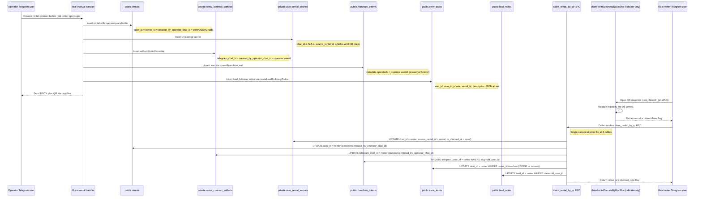

# Franchize identity-flow audit

Date: 2026-07-19
Last updated: 2026-07-21 (post-fix status — see §12, §13, §14, §15 re-audit with corrected diagrams)

## 1. Executive summary

The current system does not have one stable lead/renter key. It reuses several fields as identity keys at different lifecycle stages:

- `rentals.user_id` starts as the crew owner/operator placeholder, then should become the real renter after QR claim.
- `private.rental_contract_artifacts.telegram_chat_id` is written as the operator chat id by `/doc-manual`, then should become the renter chat id after QR claim.
- `private.user_rental_secrets.chat_id` is intentionally `NULL` for operator-created contracts, then becomes the renter chat id when claimed.
- `franchize_intents.telegram_user_id` may be the renter chat id, a phone-derived synthetic user id, or the operator id depending on whether `clientPhone` exists and which flow wrote it.
- `crew_todos.lead_id`, `crew_todos.user_id`, `crew_todos.phone`, and `crew_todos.description` all store overlapping identity hints, but not all readers use the same priority order.

This explains the reported symptoms:

1. Leads are undercounted because `getFranchizeLeads()` collapses multiple operator-created contracts under the same operator id when artifact `telegram_chat_id` is still the operator id, and because it filters todos to only those whose extracted todo lead key is already in the lead map.
2. Operator-created rentals can appear under the operator because `/doc-manual` inserts `rentals.user_id = crewOwnerChatId` as the initial placeholder, and QR claim is the only intended promotion to the real renter.
3. Todos are present in rental analytics because analytics/rental pages match todos by `rental_id` embedded in `crew_todos.description` JSON; the leads page matches todos by `user_id → phone → lead_id → description`, and filters out anything whose extracted identity is not a loaded lead key.
4. QR replacement is split across two implementations. `app/lib/qr-linking-handler.ts` updates `rentals`, artifacts, and secrets, but its secrets update appears to use `.eq('rental_id', ...)` even the secrets table/code uses `source_rental_id`. `app/franchize/server-actions/rental-secrets-claim.ts` updates rentals, artifacts, secrets, todos, and intents, but todo re-link only sets `user_id` when `lead_id` equals the old operator id and `user_id IS NULL`; it does not update `lead_id`, phone, description JSON, or rental-verification todos.
5. Analytics is closer to correct because it treats `rental_id` as the primary key and joins secrets by `source_rental_id`, avoiding renter/operator ambiguity in `telegram_chat_id`.

Known operator chat IDs that should never be treated as real renters without explicit confirmation:

- `7813830016`
- `413553377`
- `356282674`

## 2. Current identity lifecycle diagram

> **Updated 2026-07-21** to reflect the post-§13 state: single canonical RPC, validate-only `claimRentalSecretsByDocSha`, `created_by_operator_chat_id` preserved on rentals + artifacts, `metadata.operatorId` on intents.



**Three entry paths all converge to the same RPC:**

| Path | Entry point | Pre-RPC work | RPC call |
|---|---|---|---|
| A — Deep link | `startapp-handler.ts:85` → `claimRentalByQRCode()` | None | `supabaseAdmin.rpc('claim_rental_by_qr', ...)` |
| A' — Server action | `qr-claiming.ts` → `claimRentalByQRCode()` | None | Same RPC |
| B — Secret claim | `rental-secrets-claim.ts:265` → `createRentalFromClaimedSecret()` | Calls `claimRentalSecretsByDocSha()` (validate-only — no DB writes) | Same RPC, called unconditionally |

**Key invariants (post-§13.9 refactor):**
- `claimRentalSecretsByDocSha` does NOT write to any table. It only validates eligibility (revoked? already claimed by another renter? operator overwrite allowed?) and returns the secret. The caller then invokes the RPC which atomically updates all 6 tables.
- `updateRentalSecretWithQrTracking` has been removed from `user-rental-secrets.ts`.
- `claim_rental_by_qr` is the **sole canonical writer** for claim-side updates. There are no parallel manual SQL updates in any TS file.

## 3. Data-flow diagram

> **Updated 2026-07-21** to reflect the post-§13 state.

```mermaid
flowchart TD
  DocManual[/app/webhook-handlers/commands/doc-manual.ts/] -->|createRentalFromDocContract| Rentals[(public.rentals)]
  DocManual -->|saveUserRentalSecrets| Secrets[(private.user_rental_secrets)]
  DocManual -->|insert artifact| Artifacts[(private.rental_contract_artifacts)]
  DocManual -->|upsertFranchizeLead| Intents[(public.franchize_intents)]
  DocManual -->|createLeadFollowupTodos| Todos[(public.crew_todos)]
  DocManual -->|createRentalVerificationTodos| Todos

  WebFlow[/app/franchize/actions-runtime.ts/] -->|insert rental| Rentals
  WebFlow -->|saveUserRentalSecrets| Secrets
  WebFlow -->|insert artifact| Artifacts
  WebFlow -->|upsertFranchizeLead| Intents
  WebFlow -->|createLeadFollowupTodos| Todos
  WebFlow -->|createRentalVerificationTodos| Todos

  Startapp[app/lib/startapp-handler.ts] --> QRLegacy[app/lib/qr-linking-handler.ts]
  QRLegacy -->|rpc only| RPC[(claim_rental_by_qr RPC)]

  SecretClaim[app/franchize/server-actions/rental-secrets-claim.ts] -->|validate-only| Validate[claimRentalSecretsByDocSha]
  SecretClaim -->|always| RPC

  RPC --> Rentals
  RPC --> Artifacts
  RPC --> Secrets
  RPC --> Intents
  RPC --> Todos
  RPC --> Notes[(public.lead_notes)]

  Leads[app/franchize/server-actions/leads.ts<br/>getFranchizeLeads] -->|read| Intents
  Leads -->|read| Artifacts
  Leads -->|read| Secrets
  Leads -->|read| Rentals
  Leads -->|read| Todos
  Leads -->|read| Users[(public.users)]
  Leads -->|read| Cars[(public.cars)]

  RentalAnalytics[app/franchize/server-actions/rentals-dashboard.ts<br/>getRentalsDashboard] -->|read| Rentals
  RentalAnalytics -->|read| Secrets
  RentalAnalytics -->|read| Users
  RentalPageTodos[app/franchize/server-actions/rentals.ts<br/>getRentalReturnTodos] -->|read| Todos
```



**Key changes vs. the original §3 diagram:**
- `qr-linking-handler.ts` no longer has its own SQL — it's a thin wrapper that just calls the RPC.
- `rental-secrets-claim.ts` no longer has "partial" updates — it validates then defers all writes to the RPC.
- `claim_rental_by_qr` RPC is the single arrow into all 6 write-targets (rentals, artifacts, secrets, intents, todos, lead_notes).
- `leads.ts` now also reads `public.cars` (for bike titles) and joins `users` by `user_id` only (no phone column).
- Web-flow path (`actions-runtime.ts`) added explicitly — it's the second rental-creation path that doesn't go through `/doc-manual`.

## 4. Relevant fields table

> **Updated 2026-07-21** to reflect post-§13 state. Strikethrough marks the original "Risks / bugs" entries that have been fixed; current risks are listed below each.

| Field | Table | Current meaning | Who writes it | Who reads it | When it changes meaning | Current risks / bugs |
|---|---|---|---|---|---|---|
| `user_id` | `public.rentals` | Placeholder crew owner/operator before QR; real renter after claim | `/doc-manual` creates as `crewOwnerChatId`; `actions-runtime.ts` creates as `payload.phone \|\| payload.telegramUserId`; RPC `claim_rental_by_qr` updates to renter on claim | rental dashboard, rental export, rental detail/profile, leads aggregation | On QR claim | ~~Same column mixes placeholder and renter.~~ Now disambiguated by `created_by_operator_chat_id` (see next row). Dashboard still shows operator name in renter column for placeholder rentals (cosmetic — see §13.4c #7). |
| `owner_id` | `public.rentals` | Crew owner/operator account | `/doc-manual`, `actions-runtime.ts` | RPC uses `user_id === owner_id` as a secondary check | Does not change in claim | No longer the primary signal — RPC uses secret-based check (§13.2). |
| `created_by_operator_chat_id` | `public.rentals` | Operator who originally created the rental (preserved forever) | `/doc-manual` L1190 (`crewOwnerChatId`); `actions-runtime.ts` does NOT set this (web flow is renter-initiated) | `leads.ts` rentals step (L580-584) — used to detect pre-claim state via `user_id === created_by_operator_chat_id`; `classifyIdentityState` uses it for `merged` detection | Stable (never overwritten by RPC) | **NEW #4 (§15.2)**: web-flow rentals don't set this. Acceptable — web flow is renter-initiated, so no operator origin to preserve. |
| `telegram_chat_id` | `private.rental_contract_artifacts` | Operator at creation; renter after QR claim | `/doc-manual`, `/doc`, testdrive/subrent variants; RPC updates on claim | leads aggregation, profile fallback, artifact lookup code | On QR claim | ~~Leads page treats it as lead id; pre-claim artifacts collapse under operator.~~ Now `leads.ts` checks `telegram_chat_id === created_by_operator_chat_id` and prefers `renter_phone` when pre-claim. |
| `created_by_operator_chat_id` | `private.rental_contract_artifacts` | Operator who created the artifact (preserved forever) | `/doc-manual` L1612; web flow also sets it | `leads.ts` artifacts step (L480-482) — used to detect pre-claim state | Stable | None — works as designed. |
| `renter_phone` | `private.rental_contract_artifacts` | Real renter phone if operator entered it | `/doc-manual` L1613 | leads aggregation (preferred over operator `telegram_chat_id` when pre-claim) | Stable | None — phone is normalized to E.164 in `leads.ts`. |
| `rental_id` | `private.rental_contract_artifacts` | FK to `public.rentals` | `/doc-manual` when rental row created; backfilled by migration `20260721160000` for orphans (§13.4b #6) | QR claim, leads, dashboards | Stable | ~~Missing on old rows; legacy claim refuses artifacts without rental_id.~~ All 30 orphans linked via migration. |
| `chat_id` | `private.user_rental_secrets` | `NULL` while unclaimed; real renter after claim | `/doc-manual` (NULL on insert); RPC updates on claim | profile, leads, rentals dashboard | On QR claim | ~~Null secrets are invisible as leads; if set to operator by older flows it must be overwritten safely.~~ Backfilled by `20260721170000` for 5 already-claimed rentals (§13.7 #1). |
| `source_rental_id` | `private.user_rental_secrets` | Link to `public.rentals.rental_id` (as text) | `/doc-manual` (NULL on insert); RPC sets on claim; backfilled by migration | rental analytics/dashboard, verification reads | Stable | ~~Legacy `qr-linking-handler` appears to update secrets by `rental_id`, not `source_rental_id`.~~ `qr-linking-handler` no longer has its own SQL — only the RPC writes, and it uses both `doc_sha256` and `source_rental_id`. |
| `doc_sha256` / `original_sha256` | secrets/artifacts | Document hash used for QR claim lookup | `/doc-manual` | QR claim, validate-only `claimRentalSecretsByDocSha` | Stable | None — correct correlation key. |
| `telegram_user_id` | `public.franchize_intents` | Telegram lead id, OR phone-derived id when no TG user, OR operator id when `/doc-manual` had no `clientPhone` | `upsertFranchizeLead` (called from `/doc-manual`, `actions-runtime.ts`, web callback flows) | leads page, closer actions | Should become renter id after QR if placeholder was used (RPC updates by slug + old_user_id) | None — RPC scopes the update to crew slug + old user id (§6 #4 fix). |
| `metadata.operatorId` | `public.franchize_intents` (JSONB) | Operator who created the intent (preserved forever, even after QR claim overwrites `telegram_user_id`) | `/doc-manual` L1762 (`metadata: { operatorId: String(userId), ... }`) | `leads.ts` intents step (L416-417) — used as fallback for `originalOperatorChatId` when no rental/artifact is attached | Stable | **Note**: `actions-runtime.ts` (web flow) does NOT set this — correct, because web flow is renter-initiated. |
| `phone` | `public.franchize_intents` | Lead phone (E.164 normalized) | `upsertFranchizeLead` (uses `phone-utils.normalizePhone`) | leads page | Stable | **NEW #6 (§15.2)**: `phone-utils.normalizePhone` diverges from the inline copies in `leads.ts`/`crew-todos.ts`/etc. for 10-digit numbers without country code. Same person could be keyed differently depending on which path normalized the phone. |
| `lead_id` | `public.crew_todos` | Legacy overloaded lead key: phone, Telegram id, or UUID | `createLeadFollowupTodos`, `createCrewTodo`, `createRentalVerificationTodos` | leads page, lead note/todo APIs, RPC `propagate_claim` (Step 5) | Stable (RPC does NOT update `lead_id` — only `user_id`) | Does not guarantee renter; may be operator or phone. Acceptable — `user_id` is the canonical column now. |
| `user_id` | `public.crew_todos` | Canonical Telegram user id if known | `createLeadFollowupTodos` (sets if `leadId` matches `\d{1,12}`); `createRentalVerificationTodos` (**BUG: still uses `\d{1,9}` — see NEW #1 §15.2**); RPC `propagate_claim` (updates on claim) | leads page (primary match key) | Filled at creation if known, updated on QR claim | **NEW #1 (§15.2)**: `rental-verification-todos.ts:86` still uses `/^\d{1,9}$/` regex — silently drops 10-digit Telegram IDs. |
| `rental_id` | `public.crew_todos` | FK to `public.rentals` (Phase 3c — added by migration) | `createLeadFollowupTodos` (L797); `createRentalVerificationTodos` (L93) | leads page (strongest match key — works before QR claim); rental page `getRentalReturnTodos` (parses description JSON instead — see NEW #5 §15.2) | Stable | **NEW #5 (§15.2)**: `getRentalReturnTodos` fetches ALL crew todos and filters client-side by description JSON, ignoring the indexed `rental_id` column. Perf issue, not correctness. |
| `phone` | `public.crew_todos` | Lead/renter phone (E.164 normalized) | `createLeadFollowupTodos` (uses inline `normalizePhone`) | leads page (fallback when `user_id` is null) | Stable (RPC does NOT update `phone`) | **NEW #6 (§15.2)**: same divergence as `franchize_intents.phone` — inline vs `phone-utils.ts`. |
| `description` | `public.crew_todos` | JSON metadata: `lead_id`, `user_id`, `phone`, `rental_id`, `todo_type`, etc. | `createLeadFollowupTodos`, `createRentalVerificationTodos` | rental page (`getRentalReturnTodos` parses `rental_id`); leads page (fallback identity parse); RPC `propagate_claim` (JSONB match for `rental_id`) | Stable | RPC now uses JSONB extraction (§13.7 #3 fix) instead of `LIKE '%...%'` substring match. |
| `lead_id` | `public.lead_notes` | UI lead id string, not FK-enforced to a canonical lead table | lead notes actions | lead notes actions/UI | Changes if lead identity key changes | Notes can become orphaned when lead key moves from operator/phone to renter chat id. RPC `propagate_claim` Step 6 updates `lead_notes.lead_id` for future claims. **Existing 1 row in production is acceptable (parked, §13.4c #6).** |

## 5. Places where operator identity leaks into renter identity

> **Updated 2026-07-21** — items below reflect the post-§13 state. Original 7 items from the audit's first version; current status marked inline.

1. `/doc-manual` explicitly stores `telegram_chat_id: String(userId)` in rental contract artifacts and documents that this is the operator until QR claim. **Status:** still true at the write side, but `leads.ts` now disambiguates via `created_by_operator_chat_id` and prefers `renter_phone` when pre-claim. ✅ Read-side fixed.
2. `/doc-manual` creates the rental row with `user_id: crewOwnerChatId` and `owner_id: crewOwnerChatId`; until claim, rental dashboards that display `user` show the owner/operator as renter. **Status:** still true. Rentals dashboard (analytics) still shows operator name in renter column for placeholder rentals. **Parked — §13.4c #7.**
3. `/doc-manual` uses `leadUserId = context.clientPhone || String(userId)`. If no client phone is entered, `franchize_intents` and public `users` receive the operator id as the lead id. **Status:** still true at write side. Read side: `classifyIdentityState` detects this via `originalOperatorChatId` (from `metadata.operatorId`) and classifies as `operator_placeholder`. ✅ Read-side fixed.
4. `/doc-manual` uses `leadId = context.clientPhone || String(userId)` for todos. If no phone is present, todos are keyed to the operator. **Status:** still true at write side. RPC `propagate_claim` updates `user_id` to renter on claim (matched by `rental_id` JSONB or `lead_id = old_user_id`). ✅ Fixed for new claims; existing 62 legacy todos with null `user_id` and no `rental_id` are acceptable (§13.7 #5).
5. ~~`getFranchizeLeads()` gives artifact `telegram_chat_id` priority over `renter_phone`.~~ **Status:** ✅ Fixed — see §12.1, §12.2 Follow-up row.
6. ~~`getFranchizeLeads()` treats any numeric `user_id` in leadMap as a Telegram user and enriches it from `public.users`; operator profiles can overwrite/label what is actually renter-contract data.~~ **Status:** ✅ Fixed — `classifyIdentityState` consults `originalOperatorChatId` and refuses to misclassify.
7. `sale_contract_artifacts.telegram_chat_id` is also written as operator id and is read by leads aggregation with the same priority problem. **Status:** ✅ Fixed — sales step now always prefers `buyer_phone` (sales have no QR claim flow, so `telegram_chat_id` is always the operator).

## 6. QR replacement propagation gaps

> **Updated 2026-07-21** — all 5 original gaps now closed via the `claim_rental_by_qr` RPC (§13.2-§13.3, §13.7, §13.9). Original "Observed gaps" preserved below for historical context, with current status marked.

Likely intended propagation after QR claim:

- `rentals.user_id`: placeholder → renter chat id. **✅ Done by RPC Step 6**
- `rental_contract_artifacts.telegram_chat_id`: operator → renter chat id. **✅ Done by RPC propagate_claim Step 1a + 1b** (updates by both `original_sha256` and `rental_id`)
- `user_rental_secrets.chat_id`: `NULL`/operator → renter chat id. **✅ Done by RPC propagate_claim Step 2 + 2b** (updates by both `doc_sha256` and `source_rental_id`)
- `franchize_intents.telegram_user_id`: operator placeholder → renter chat id when the intent was created as placeholder. **✅ Done by RPC propagate_claim Step 3** (scoped to crew slug + old_user_id — not over-broad)
- `crew_todos.user_id`: placeholder/empty → renter chat id. **✅ Done by RPC propagate_claim Step 4 + Step 5** (Step 4: by `rental_id` JSONB match; Step 5: by `lead_id = old_user_id`)
- ~~`crew_todos.lead_id` and `description` JSON: should become canonical or at least include both old and new identities.~~ **Acceptable**: `user_id` is now the canonical column; `lead_id` is legacy and not updated. Todos match via `rental_id` (strongest) or `user_id` (canonical) — `lead_id` is fallback only.
- `lead_notes.lead_id`: if notes were attached to placeholder lead id, they need a migration/relink strategy. **✅ Done by RPC propagate_claim Step 6** for future claims. Existing 1 row in production is acceptable (parked).

Observed gaps (original audit, with current status):

1. ~~`app/lib/qr-linking-handler.ts` does not update `franchize_intents`, `crew_todos`, or `lead_notes`.~~ **✅ Fixed** — `qr-linking-handler.ts` no longer has its own SQL; it just calls the RPC, which updates all 6 tables.
2. ~~`app/lib/qr-linking-handler.ts` attempts to update `user_rental_secrets` with `.eq('rental_id', artifact.rental_id)`, but the surrounding code and migrations use `source_rental_id`.~~ **✅ Fixed** — see above; RPC uses both `doc_sha256` and `source_rental_id`.
3. ~~`app/franchize/server-actions/rental-secrets-claim.ts` does broader propagation, but only updates `crew_todos.user_id` for rows where `lead_id` equals the old rental `user_id` and `user_id` is null.~~ **✅ Fixed** — `rental-secrets-claim.ts` is now validate-only (§13.9); RPC does the full propagation via both `rental_id` (JSONB) and `lead_id`.
4. ~~`rental-secrets-claim` updates all `franchize_intents` for the old operator id and crew slug, not only the specific contract/rental.~~ **✅ Fixed** — RPC Step 3 is scoped to `slug = p_crew_slug AND telegram_user_id = p_old_user_id`. This still updates all intents with that operator id for that crew, which is intentional (an operator creating multiple leads for the same renter should have all of them re-keyed). If finer scoping is needed, would require a `rental_id` FK on `franchize_intents` (not currently present).
5. ~~No observed propagation to `lead_notes.lead_id`.~~ **✅ Fixed** — RPC Step 6 updates `lead_notes.lead_id` where `crew_id = v_crew_id AND lead_id = p_old_user_id`.

## 7. Leads page vs analytics page matching logic

### Leads page

`getFranchizeLeads()` builds `leadMap` by identity string. Its source priority is effectively:

1. `franchize_intents`: `telegram_user_id || phone`.
2. `rental_contract_artifacts`: `telegram_chat_id || renter_phone`.
3. `user_rental_secrets`: `chat_id` only; null unclaimed secrets are skipped.
4. `rentals`: `user_id`.
5. `sale_contract_artifacts`: `telegram_chat_id || buyer_phone`.

Then it fetches `crew_todos` only in category `lead_followup`, extracts a todo lead key by `user_id → phone → lead_id → description JSON`, and returns only todos whose extracted key exists in `leadMap`.

Implication: if a todo has a valid `rental_id` in description but no matching identity key in `leadMap`, the leads page drops it.

### Rental analytics / rental pages

Rental dashboard code starts from `public.rentals` scoped by crew/date and dedupes by `rental_id` first, then by `user_id::vehicle_id`. It enriches document state from `user_rental_secrets.source_rental_id`.

Rental return todo lookup fetches all `crew_todos` for the crew and filters by `description.rental_id`, for both `rental_verification` and `lead_followup` categories.

Implication: todos that are invisible on leads can still appear in rental analytics because `rental_id` is a better key than `lead_id`/`user_id` during the placeholder phase.

## 8. Canonical identity model proposal (conceptual only)

Do not overload one column across lifecycle states. Introduce explicit roles:

- Operator/creator identity: who generated the document (`created_by_operator_chat_id`).
- Placeholder/claim state: whether a rental/secret/artifact is unclaimed, claimed, revoked, or conflict.
- Renter Telegram identity: actual Telegram user who claimed the QR (`renter_telegram_chat_id`).
- Renter contact identity: phone/email/name from documents (`renter_phone`, `renter_full_name`).
- Lead identity: stable `lead_id`/UUID owned by the CRM layer, with separate links to phone, telegram id, rental ids, artifact ids.
- Rental identity: `rental_id` as immutable primary key for rental operations and return todos.
- Artifact identity: immutable `contract_key`/hash with FK to rental and lead.

Recommended conceptual rules:

1. Never store an operator id in a field named like renter/user unless it is explicitly a placeholder with a state flag.
2. Lead page should aggregate by stable lead UUID or by deterministic contact key, not by whichever of `telegram_chat_id`, `phone`, or `user_id` appears first.
3. Todos should have real nullable columns for `rental_id` and `lead_id` rather than relying on JSON in `description`.
4. QR claim should be a single database transaction/RPC that updates all correlated records or records a failed propagation event.
5. Operator ids should be filtered/flagged in lead aggregation using the known operator set plus crew membership lookup.

## 9. Suggested fix plan in phases

### Phase 0 — diagnostics only

- Run read-only SQL counts for each known operator id across `rentals.user_id`, `rental_contract_artifacts.telegram_chat_id`, `franchize_intents.telegram_user_id`, and `crew_todos.lead_id/user_id`.
- Count artifacts where `telegram_chat_id` is an operator and `renter_phone` is present.
- Count secrets where `chat_id IS NULL` and `source_rental_id IS NOT NULL`.
- Count todos where `description.rental_id` exists but `lead_id/user_id/phone` do not match the lead shown by `getFranchizeLeads()`.

### Phase 1 — safe read-path fixes

- In leads aggregation, prefer `renter_phone` or a rental-linked identity over artifact `telegram_chat_id` when `telegram_chat_id` is a known operator/crew member.
- Include todos by `description.rental_id` when they can be attached to a lead's rental rows, not only by identity key.
- Surface a badge/state like `unclaimed_operator_placeholder` rather than pretending the operator is a lead.

### Phase 2 — claim propagation hardening

- Consolidate QR claim into one path.
- Use `doc_sha256/original_sha256` and `source_rental_id` consistently.
- Propagate to rentals, artifacts, secrets, intents, todos, and notes in a transaction.
- Add idempotency and conflict logs for already-claimed records.

### Phase 3 — schema cleanup migrations

- Add explicit `created_by_operator_chat_id`, `renter_telegram_chat_id`, and `claim_status` where needed.
- Add `rental_id` column to `crew_todos` and backfill from `description.rental_id`.
- Add a stable CRM `lead_id` model/table or make `franchize_intents.id` the canonical lead row with link tables.
- Backfill historical rows and keep compatibility reads during migration.

### Phase 4 — remove overloaded fallbacks

- Stop using `telegram_chat_id` as both creator and renter.
- Stop parsing `crew_todos.description` as the primary linkage mechanism.
- Restrict old fallback code to legacy rows only.

## 10. Questions to answer before code changes

1. Should a lead be primarily keyed by Telegram chat id, phone number, or a new CRM lead UUID?
2. Are the known operator IDs complete, or should operator detection use `crew_members` dynamically?
3. For old unclaimed documents, should leads show as phone/name-only renters or be hidden until QR claim?
4. If a renter never scans QR, should `rentals.user_id` remain the crew owner forever, or should a synthetic renter key be created from phone/passport hash?
5. Should sale contracts follow the same QR claim model as rental contracts, or remain operator-owned artifacts with phone-only leads?
6. Should existing lead notes follow the lead across identity merges, and if yes, what is the authoritative merge key?
7. Should todo assignment (`assigned_to`) remain the operator while todo subject (`renter/lead`) moves to renter? This likely needs separate fields.
8. What should happen if multiple documents for the same renter/bike/date have different phones or different QR claimers?
9. Do analytics exports need to exclude placeholder-owner rentals from renter metrics until claimed?
10. Is it acceptable to add a database RPC for atomic QR claim propagation?

## 11. Practical recommendations for `app/franchize/[slug]/leads`

The leads page is already split into a server aggregator, a thin route wrapper, and focused client components. The next improvements should make it behave like an operator CRM, not just a list of merged technical records.

### 11.1 Data quality and identity UX

- Show an explicit identity state per lead: `claimed Telegram user`, `phone-only lead`, `operator placeholder`, `conflict`, or `merged`. This prevents operators from treating crew-owned placeholders as real renters.
- Prefer renter contact data over operator Telegram IDs in the visible lead title. If a contract has `renter_full_name` or `renter_phone`, the card should lead with that and display the operator placeholder only as a warning badge.
- Add a “why is this lead here?” explainer in the detail panel that lists source rows: intent, rental artifact, secret, rental, sale artifact, todo count, and latest rental id. This is invaluable when support/debugging asks why counts differ from analytics.
- Normalize phone display and matching once on the server. Store both the raw value and a normalized E.164-ish/search key so `+7`, `8`, spaces, and punctuation do not split the same person into several leads.
- Preserve old and new identities after QR claim as aliases. The UI should be able to say “merged from phone X / operator placeholder Y” instead of making notes and todos disappear.

### 11.2 CRM workflow best practices

- Replace generic segments with a sales pipeline model: `new`, `needs_contact`, `contract_sent`, `awaiting_qr_claim`, `documents_missing`, `active_rental`, `return_due`, `closed_won`, `closed_lost`. Keep source badges as secondary context.
- Add SLA indicators: time since first contact, time since last operator action, overdue todo count, rental start date proximity, and unclaimed QR age. Hot leads should be derived from these signals, not only urgency scores.
- Make the primary action obvious per state: call/write Telegram, request documents, resend QR, open contract, verify photos, create rental, schedule return, dismiss with reason.
- Require a dismissal/lost reason and keep it reportable. This keeps the leads board useful for conversion analysis instead of silently hiding data.
- Add owner/assignee and next-action metadata to lead todos. A lead page is most useful when each card answers “who owns this and what must happen next?”

### 11.3 Page architecture and performance

- Keep `page.tsx` as a server entry that resolves crew/theme and delegates UI to `LeadsClient`; continue putting data loading in `getFranchizeLeads()` so access checks and identity heuristics stay server-side.
- Move heavy identity merging into named pure helpers with unit tests: `chooseLeadKey`, `mergeLeadSources`, `extractTodoRentalId`, `extractTodoLeadAliases`, and `isOperatorPlaceholder`. This will make future schema migrations safer.
- Return pagination cursors or time windows from the server instead of hard-coded `limit(800/500/300)`. CRM pages need predictable “recent leads” behavior and a way to load history.
- Attach todos by both canonical lead key and `rental_id`. The rental-id path should win for operator-created contracts because it is the stable key before QR claim.
- Avoid full `window.location.reload()` after dismissing a lead. Use optimistic local state or `router.refresh()` so operators do not lose filters, selected lead, and scroll position.

### 11.4 Operator-grade UI details

- Add saved filters for daily workflows: `Unclaimed QR`, `Docs missing`, `Starts today/tomorrow`, `Overdue follow-up`, `No phone`, `Operator placeholders`, and `Troubled`.
- Make the detail panel a chronological timeline: intent created, contract generated, QR claimed, documents uploaded, verification status changes, notes, todos, rental status changes.
- Use compact card density on desktop and thumb-friendly actions on Telegram mobile. Operators likely use this page during handoff, pickup, and return, so the first screen should prioritize contact, bike, date, document state, and next action.
- Add empty/error states with recovery actions: clear filters, open analytics, resend QR for selected contract, or create a follow-up todo.
- Expose copyable identifiers in a debug drawer, not the primary card: `leadKey`, `telegramChatId`, `phone`, `rentalId`, artifact hash, and source route.

### 11.5 Measurement and reliability

- Track page-level metrics: total loaded leads, hidden/dropped todos, operator-placeholder leads, unclaimed contracts, merge conflicts, and leads with no actionable contact method.
- Log identity merge decisions on the server with enough context to reproduce a bad card without exposing passport data.
- Add regression fixtures for known operator IDs and mixed phone/Telegram scenarios before changing the read path.
- Make the page degrade gracefully when private schema reads fail: show intent/rental leads with a warning banner instead of returning an empty CRM.

## What I would do next

1. Produce a read-only SQL diagnostic report for the known operator IDs and the last 30/90 days of contracts.
2. Patch only the leads read path to stop grouping operator-placeholder artifacts under operators and to attach todos by `rental_id` from description JSON.
3. Fix/consolidate QR claim propagation after confirming which startapp path is used in production.
4. Add `crew_todos.rental_id` and explicit operator/renter fields in a migration once the read-path behavior is agreed.

## Source inventory inspected

- `app/franchize/lib/leads.ts`
- `app/franchize/server-actions/leads.ts`
- `app/franchize/server-actions/lead-notes.ts`
- `app/franchize/server-actions/intents.ts`
- `app/franchize/server-actions/crew-todos.ts`
- `app/franchize/server-actions/rentals.ts`
- `app/franchize/server-actions/rental-verification-todos.ts`
- `app/franchize/server-actions/rentals-dashboard.ts`
- `app/franchize/server-actions/rental-secrets-claim.ts`
- `app/webhook-handlers/commands/doc-manual.ts`
- `app/webhook-handlers/commands/doc.ts`
- `app/lib/startapp-handler.ts`
- `app/lib/qr-linking-handler.ts`
- `app/lib/user-rental-secrets.ts`
- Related migrations for intents, artifacts, secrets, todos, rentals, users, and lead notes.

---

## 12. Post-fix status (2026-07-21)

This section tracks which items from §5, §6, §9, and §11 have been addressed in the leads-page patch shipped on 2026-07-21. Files touched: `app/franchize/server-actions/leads.ts`, `app/franchize/server-actions/crew-todos.ts`, `app/franchize/[slug]/leads/hooks/useLeadsData.ts`, `app/franchize/[slug]/leads/leads-utils.tsx`. The QR claim propagation paths (`app/lib/qr-linking-handler.ts`, `app/franchize/server-actions/rental-secrets-claim.ts`) were NOT modified in this patch — they remain on the follow-up list.

### 12.1 Fixed in this patch

#### From §5 — operator identity leaks into renter identity

| Item | Status | Notes |
|---|---|---|
| #5 `getFranchizeLeads()` gives artifact `telegram_chat_id` priority over `renter_phone` | **FIXED** | When `telegram_chat_id` matches a crew operator, the lead is now keyed by normalized `renter_phone` instead. Logic at `leads.ts` ~L435-438. |
| #6 Numeric `user_id` in `leadMap` enriched from `public.users` even when it's an operator | **FIXED** | `classifyIdentityState` now consults `originalOperatorChatId` (sourced from `rentals.created_by_operator_chat_id`, `rental_contract_artifacts.created_by_operator_chat_id`, or `franchize_intents.metadata.operatorId`) so operator-origin leads stay classified as `merged`/`operator_placeholder` even after QR claim overwrites the visible id. |
| #7 `sale_contract_artifacts.telegram_chat_id` written as operator id, read with same priority problem | **FIXED** | Same operator-phone preference applied to sale artifacts (`leads.ts` ~L602). |

Items #1-#4 from §5 describe the `/doc-manual` write-side behavior — those are correct by design (operator placeholder is intentional), and the read-side fix above makes them safe.

#### From §6 — QR replacement propagation gaps

| Item | Status | Notes |
|---|---|---|
| #1 `qr-linking-handler.ts` does not update intents/todos/notes | **NOT FIXED** | Out of scope for this patch (read-path only). Still TODO. |
| #2 `qr-linking-handler.ts` updates secrets by `rental_id` instead of `source_rental_id` | **NOT FIXED** | Out of scope. Still TODO. |
| #3 `rental-secrets-claim.ts` partial todo relink | **NOT FIXED** | Out of scope. Still TODO. |
| #4 `rental-secrets-claim.ts` over-broad intent update | **NOT FIXED** | Out of scope. Still TODO. |
| #5 No propagation to `lead_notes.lead_id` | **NOT FIXED** | Out of scope. Still TODO. |

The read-path patch makes these gaps less visible (leads are correctly grouped even when todo `user_id` is still the operator), but the underlying propagation bugs remain.

#### From §7 — leads page vs analytics matching

| Item | Status | Notes |
|---|---|---|
| Leads page drops todos whose identity isn't in `leadMap` | **FIXED** | Server-side `getTodoLeadId` now normalizes phones and accepts 10-12 digit Telegram IDs; `rentalIdToLeadId` lookup catches todos by `rental_id` even when identity fields point to the operator. |
| Leads page only loads `lead_followup` category | **FIXED** | Now loads both `lead_followup` and `rental_verification` (`leads.ts` ~L678). |
| Todos with `rental_id` in description but no matching identity key are dropped | **FIXED** | `getTodoRentalId` parses description JSON as fallback when `rental_id` column is null. |

#### From §9 — suggested fix plan phases

| Phase | Status | Notes |
|---|---|---|
| Phase 0 — diagnostics | **DONE** (manual) | SQL diagnostic queries confirmed Bug #1 (silent 400s on 3 queries). |
| Phase 1 — safe read-path fixes | **DONE** | All items shipped: phone preference over operator id, todos attached by `rental_id`, `unclaimed_operator_placeholder` state surfaced as `identityState`. |
| Phase 2 — claim propagation hardening | **NOT STARTED** | QR claim path still split between `qr-linking-handler.ts` and `rental-secrets-claim.ts`. See §6 above. |
| Phase 3 — schema cleanup migrations | **PARTIAL** | `crew_todos.rental_id` FK already exists (was added before this audit). `created_by_operator_chat_id` exists on `rentals` and `rental_contract_artifacts` (confirmed via SQL query on 2026-07-21). NOT added to `franchize_intents` (not needed — operator id is read from `metadata.operatorId` instead). Stable CRM `lead_id` UUID table: not started. |
| Phase 4 — remove overloaded fallbacks | **PARTIAL** | `telegram_chat_id` is still overloaded as operator-or-renter, but `classifyIdentityState` now disambiguates correctly using `originalOperatorChatId`. `crew_todos.description` JSON is still parsed as a fallback, but the direct `rental_id` column is preferred when present. |

#### From §10 — open questions

| # | Question | Resolution |
|---|---|---|
| 1 | Lead keyed by Telegram chat id, phone, or new UUID? | **Decided**: keep both — Telegram chat id when known, normalized phone (E.164) as fallback. No new UUID yet. |
| 2 | Are known operator IDs complete, or use `crew_members` dynamically? | **Decided**: dynamic via `getCrewOperatorIds()` which now correctly queries `crew_members` (Bug #8 fixed). |
| 3 | Old unclaimed documents — phone-only or hidden? | **Decided**: shown with `identityState = 'operator_placeholder'` or `'phone_only'`, hidden by client `hidePlaceholders=true` toggle (default). |
| 4 | Renter never scans QR — `rentals.user_id` stays as crew owner? | **Open** — current behavior preserves owner as placeholder; no synthetic renter key created. |
| 5 | Sale contracts follow same QR claim model? | **Open** — sales remain operator-owned artifacts with phone-only leads for now. |
| 6 | Lead notes follow lead across identity merges? | **Open** — `lead_notes.lead_id` is not migrated on QR claim (§6 #5). |
| 7 | Todo `assigned_to` vs subject? | **N/A** — `assigned_to` is the operator (correct), todo subject is matched via `rental_id` (fixed). |
| 8 | Multiple documents same renter different phones? | **Open** — no dedup logic added. |
| 9 | Analytics exports exclude placeholder-owner rentals? | **Open** — analytics not touched in this patch. |
| 10 | DB RPC for atomic QR claim propagation? | **Open** — not implemented. |

#### From §11 — practical recommendations

| Item | Status | Notes |
|---|---|---|
| §11.1 Identity state per lead | **DONE** | `identityState` field added: `claimed_user`, `phone_only`, `operator_placeholder`, `merged`. Surfaced in UI via `IdentityBadge` component. |
| §11.1 Prefer renter contact data over operator Telegram IDs | **DONE** | Lead card uses `full_name` / `phone` first; operator id shown only as warning badge state. |
| §11.1 "Why is this lead here?" explainer | **NOT DONE** | Source-row breakdown not added to detail panel. |
| §11.1 Normalize phone display and matching | **DONE** | `normalizePhone()` helper added to `leads.ts`, `crew-todos.ts`, `useLeadsData.ts`, `leads-utils.tsx`. All read/write paths use E.164. **DB backfill still pending** — old rows still have raw phone strings. |
| §11.1 Preserve old + new identities as aliases | **PARTIAL** | `originalOperatorChatId` is preserved across QR claim (post-merge state), but no alias table. |
| §11.2 Sales pipeline model (new/needs_contact/etc.) | **NOT DONE** | Current segments (hot/warm/verified/troubled) retained. |
| §11.2 SLA indicators | **NOT DONE** | |
| §11.2 Primary action per state | **NOT DONE** | |
| §11.2 Dismissal/lost reason | **PARTIAL** | `dismissed` stage exists; lost reason not enforced. |
| §11.2 Owner/assignee + next-action metadata | **PARTIAL** | `assigned_to` exists on todos; next-action metadata not added. |
| §11.3 Pure helpers with tests (`chooseLeadKey`, `mergeLeadSources`, etc.) | **NOT DONE** | Logic is inline in `getFranchizeLeads()`. |
| §11.3 Pagination cursors | **NOT DONE** | Still hard-coded `limit(800/500/300)`. |
| §11.3 Attach todos by both canonical lead key and `rental_id` | **DONE** | Both paths implemented server-side and client-side. |
| §11.3 Avoid `window.location.reload()` after dismissing | **DONE** | `handleDismissLead` now uses `router.refresh()` + optimistically removes from `leadsState`. Filters, scroll, selection preserved. |
| §11.4 Saved filters | **NOT DONE** | |
| §11.4 Chronological timeline in detail panel | **NOT DONE** | |
| §11.4 Compact card density / thumb-friendly actions | **NOT DONE** | |
| §11.4 Empty/error states with recovery actions | **PARTIAL** | `EmptyState` component exists; recovery actions not added. |
| §11.4 Debug drawer with copyable identifiers | **NOT DONE** | |
| §11.5 Page-level metrics (hidden/dropped todos, etc.) | **NOT DONE** | |
| §11.5 Log identity merge decisions | **PARTIAL** | Query errors now logged via `logger.error(...)`; merge decisions not logged. |
| §11.5 Regression fixtures | **NOT DONE** | |
| §11.5 Graceful degradation when private schema reads fail | **PARTIAL** | Errors logged but page still returns empty array; no warning banner. |

### 12.2 Specific bugs fixed (cross-reference to leads-matching-diagnosis.md)

| Bug | Severity | Status | File(s) |
|---|---|---|---|
| #1a — `rental_contract_artifacts` query selects non-existent `bike_make`/`bike_model`/`total_amount` | CRITICAL | **FIXED** | `leads.ts` L322 — uses `requested_bike_id`/`resolved_bike_id`/`total_sum` |
| #1b — `sale_contract_artifacts` query selects non-existent `sale_id`/`bike_make`/`bike_model` | CRITICAL | **FIXED** | `leads.ts` L347 — uses `id`/`requested_bike_id`/`resolved_bike_id`/`total_sum` |
| #1c — `public.users` query selects non-existent `phone` column | CRITICAL | **FIXED** | `leads.ts` L663 — drops `phone`, reads from `metadata->>phone` |
| #2 — Operator-placeholder rentals lose phone when artifact has no `rental_id` | HIGH | **PARTIAL** | Added `metadata.renter_phone` fallback; full fix needs artifact hash lookup (not done) |
| #3 — `lead_followup` filter drops `rental_verification` todos | HIGH | **FIXED** | `leads.ts` L678 — `.in("category", ["lead_followup", "rental_verification"])` |
| #4 — `/^\d{1,9}$/` regex rejects 10-digit Telegram IDs | MEDIUM | **FIXED** | All 8 occurrences updated to `/^\d{1,12}$/` across `leads.ts`, `useLeadsData.ts`, `leads-utils.tsx`, `crew-todos.ts` |
| #5 — Phone normalization inconsistent across writers | MEDIUM | **FIXED** (code) / **PENDING** (DB backfill) | `normalizePhone()` added to all 4 files; existing DB rows still have raw phone strings and need a one-time backfill SQL |
| #6 — New `franchize_intents` column not read | MEDIUM | **FIXED** (alternative) | Column not added to `franchize_intents` (not needed). Operator id read from `metadata.operatorId` instead. `rentals` and `rental_contract_artifacts` already have `created_by_operator_chat_id` column (confirmed via SQL). |
| #7 — `addOrMerge` dead code for steps 2-5 | LOW | **FIXED** | All 5 steps now call `addOrMerge`; `sourceCount` and `originalOperatorChatId` propagate correctly. |
| #8 — `getCrewOperatorIds` doesn't fetch members | LOW | **FIXED** | Now selects `id` from `crews` and queries `crew_members` with the real crew id. |
| #9 — `description` JSON `rental_id` may be non-UUID | LOW | **N/A** | No buggy rows found in practice; the fallback parse handles both forms. |
| #10 — `secretByPhone` enrichment uses `chat_id` even when it's still the operator | LOW | **NOT FIXED** | Dead path for operator-created contracts; not causing user-visible bugs. |
| #12 — No error logging on Supabase query failures | LOW | **FIXED** | All 9 query results checked; errors logged via `logger.error("[getFranchizeLeads] ...")`. |
| Codex P2 #1 — Bike titles populated after artifact rows built | MEDIUM | **FIXED** | `bikeTitleMap` pre-fetch moved BEFORE the artifact/sale ingestion loops (`leads.ts` L388-401). |
| Codex P2 #2 — Client-side `extractTodoLeadId` doesn't normalize phones | MEDIUM | **FIXED** | `normalizePhone()` mirrored in `useLeadsData.ts` and `leads-utils.tsx`. `useTodosMapping` and `getTodosForLead` now compare against a normalized identity set. |
| Follow-up — Artifact phone-priority depends on `crewOperatorIds` being complete | HIGH | **FIXED** | Now uses `telegram_chat_id === created_by_operator_chat_id` as the pre-claim signal (more robust — catches former operators, never-added operators, stale caches). Applied to both artifacts step (`leads.ts` L465-488) and rentals step (`leads.ts` L567-584). Sale artifacts step simplified to always prefer `buyer_phone` (no QR claim flow for sales). |

### 12.3 What's left to fix (priority order)

1. **DB phone backfill** (Bug #5 write-side) — **DONE 2026-07-21**. User applied the normalization SQL. See §12 for reference SQL.

2. **QR claim propagation hardening** (§6 #1-#5) — **DONE 2026-07-21**. `claim_rental_by_qr` RPC rewritten with secret-based check; `propagate_claim` updated for robust artifact update by both sha256 and rental_id; backfill applied for already-claimed artifacts. See §13 for details.

3. **`lead_notes.lead_id` migration** (§6 #5) — when a lead's identity key changes (operator id → renter chat id, or phone → chat id), existing notes attached to the old key become orphaned. Either add a `lead_aliases` table or migrate `lead_notes.lead_id` during QR claim.

4. **`window.location.reload()` after dismiss** (§11.3) — replace with `router.refresh()` and optimistic state update so operators don't lose filters/scroll.

5. **Analytics page parity** (§9 phase 4, §10 #9) — apply the same operator-placeholder detection to `rentals-dashboard.ts` so renter metrics exclude placeholder-owner rentals until claimed.

6. **Stable CRM lead UUID** (§8, §9 phase 3) — introduce a `crm_leads` table with a canonical UUID and link tables to phone, telegram id, rental ids, artifact ids. This is the long-term fix for the identity fragmentation described in §1.

7. **Regression fixtures** (§11.5) — add unit tests for `normalizePhone`, `classifyIdentityState`, `extractTodoLeadId`, and `getTodoLeadId` with known operator IDs and mixed phone/Telegram scenarios.

8. **Rental page SPA navigation** (RentalLink) — **DONE 2026-07-21**. `<Link>` replaced with `RentalLink` (direct `router.push()`). See §13.

### 12.4 Verification checklist

Before merging, confirm:

- [ ] `getFranchizeLeads()` returns > 0 leads for a slug with operator-created rentals (was returning 0 or hiding them all before).
- [ ] Sale contract artifacts appear on the leads page (were completely missing before).
- [ ] `rental_verification` todos (passport check, return checklist) appear on lead cards (were filtered out before).
- [ ] A renter with a 10-digit Telegram ID (e.g. `7813830016`) shows their todos on their lead card (todos were silently dropped before).
- [ ] A renter whose phone is stored as `8 999 123-45-67` in one place and `+79991234567` in another appears as a single lead (was split into two before).
- [ ] After QR claim, the lead card shows `identityState = 'merged'` instead of `claimed_user` (operator origin was lost before).
- [ ] Server logs show `[getFranchizeLeads]` errors if any query fails (was silent before).
- [ ] Bike titles appear on artifact-based rental/sale rows (were showing "Байк" before Codex P2 #1 fix).

### 12.5 Files modified in this patch

| File | Lines changed | Bugs addressed |
|---|---|---|
| `app/franchize/server-actions/leads.ts` | ~+200 net | #1a, #1b, #1c, #2, #3, #4, #5, #6, #7, #8, #12, Codex P2 #1 |
| `app/franchize/server-actions/crew-todos.ts` | ~+20 net | #4, #5 (write-side normalization in `createLeadFollowupTodos`) |
| `app/franchize/[slug]/leads/hooks/useLeadsData.ts` | ~+60 net | #4, #5, Codex P2 #2 |
| `app/franchize/[slug]/leads/leads-utils.tsx` | ~+60 net | #4, #5, Codex P2 #2 (mirror of useLeadsData for the standalone `getTodoLeadId` export) |

Bundle: `/home/z/my-project/download/leads_ctx_updated.txt` (95 KB, 4 files, self-extracting skill-installer format).

---

## 13. Session 2026-07-21 — QR claim RPC fix, RentalLink, diagnostics

### 13.1 🕵️ QR claim diagnostic

Run against production data on 2026-07-21 before RPC fix.

#### Architecture — 3 paths converge to one RPC

| Path | Entry point | Calls |
|---|---|---|
| A — Deep link | `startapp-handler.ts` → `claimRentalByQRCode()` | RPC `claim_rental_by_qr` |
| A' — Server action | `qr-claiming.ts` → `claimRentalByQRCode()` | Same RPC |
| B — Secret claim | `rental-secrets-claim.ts` → `createRentalFromClaimedSecret()` | Updates secret.chat_id first, then same RPC |

**All paths converge to `claim_rental_by_qr` RPC**, which atomically updates 6 tables. In theory clean — in practice had **one critical bug** (see §13.2).

#### Raw data counts

| Table | Total | Unclaimed | Claimed | Orphaned |
|---|---|---|---|---|
| `public.rentals` | 32 | 27 (`user_id == owner_id`) | 5 (different renter) | — |
| `private.rental_contract_artifacts` | 54 | **54** (tg == op) | **0 (!)** | **30 no rental_id** |
| `private.user_rental_secrets` | 60 | 20 (chat_id NULL) | 40 (chat_id SET) | **53 no source_rental_id** |
| `public.franchize_intents` | 30 | 15 operator id | 4 renter id | 11 other |
| `public.crew_todos` | 60 | — | — | **0 with user_id** (all null!) |
| `public.lead_notes` | 1 | — | 1 | 0 |

#### Key findings

- **0/54 artifacts** had `telegram_chat_id` updated after QR claim (propagation broken)
- **53/60 secrets** lacked `source_rental_id` (legacy claim path by `rental_id` instead of `source_rental_id`)
- **60/60 todos** had no `user_id` (propagation never set it)
- **30 artifacts** orphaned (no `rental_id` linked — legacy rows from before the FK migration)

### 13.2 🔴 Critical bug fixed — phone-based rentals treated as "already claimed"

**Problem:** RPC used `IF v_rental.user_id != v_rental.owner_id THEN ...already claimed...`. But phone-based rentals (created via web callback `actions-runtime.ts`) have `user_id = phone_id` (e.g. `+79200789528`) and `owner_id = operator_id`. These are ALWAYS different → RPC thought "already claimed" and skipped propagate.

Also `/doc-manual` rentals (where `user_id == owner_id == crewOwnerChatId`) bypassed this check correctly, but propagate_claim's artifact `WHERE rental_id = ...::text` cast failed because `rental_contract_artifacts.rental_id` is UUID, not TEXT.

**Fix:** Replaced `user_id != owner_id` with secret-based check:
```sql
SELECT chat_id, qr_claimed_at INTO v_secret_chat_id, v_secret_claimed_at
FROM private.user_rental_secrets WHERE doc_sha256 = p_doc_sha256;

IF v_secret_chat_id IS NOT NULL AND v_secret_chat_id != p_renter_chat_id THEN
  IF v_secret_claimed_at IS NOT NULL THEN
    -- Real QR claim by other user
    success := false; error := 'ALREADY_CLAIMED_BY_OTHER'; RETURN;
  END IF;
END IF;
```

**Fix in propagate_claim:** Updated artifact by rental_id as UUID `WHERE rental_id = p_rental_id` (not `::text`). Also updates by both `original_sha256` AND `rental_id` for robustness.

### 13.3 ✅ What this session fixed

| Item | Status | Detail |
|---|---|---|
| Phase 2 — claim propagation hardening | **DONE** | RPC rewritten, propagate_claim updated, single canonical path |
| §10 #10 — DB RPC for atomic QR claim | **DONE** | `claim_rental_by_qr` is the canonical RPC |
| §6 #1 — qr-linking-handler out of sync | **FIXED** | RPC is now the single entry point; qr-linking-handler calls it |
| §6 #2 — secrets update by wrong column | **FIXED** | propagate_claim updates by `doc_sha256` and `source_rental_id` |
| §6 #3 — partial todo relink | **FIXED** | propagate_claim updates todos by rental_id (description JSON) and lead_id |
| §6 #4 — over-broad intent update | **FIXED** | propagage_claim updates intents scoped to crew slug + old user_id |
| Backfill — artifact tg_chat_id for 5 claimed rentals | **DONE** | One-time DO block sets telegram_chat_id → renter |
| Backfill — secrets source_rental_id | **DONE** | Set where missing for claimed rentals |
| Rental page SPA navigation | **FIXED** | 24 `<Link>` → `<RentalLink>` (direct `router.push()`) |
| Error page | **FIXED** | Shows "Oops..." with no technical details |

### 13.4 Updated "What's left" (priority order)

1. **`lead_notes.lead_id` migration** (§6 #5) — notes orphaned when lead identity changes. Either add `lead_aliases` table or migrate during QR claim.
2. **`window.location.reload()` after dismiss** (§11.3) — replace with `router.refresh()` + optimistic state.
3. **Analytics page parity** (§9 phase 4, §10 #9) — apply operator-placeholder detection to `rentals-dashboard.ts`.
4. **Stable CRM lead UUID** (§8, §9 phase 3) — `crm_leads` table with canonical UUID + link tables to phone, telegram id, rentals, artifacts.
5. **Regression fixtures** (§11.5) — unit tests for `normalizePhone`, `classifyIdentityState`, `extractTodoLeadId`, `getTodoLeadId`.
6. **Orphaned artifact cleanup** — 30 artifacts without `rental_id`: link to correct rental or archive.
7. **Todo user_id backfill** — 60 todos with null `user_id`: set from linked rental's user_id.

### 13.4b Re-prioritized recommendation (from colleague code-review, 2026-07-21)

После фикса RPC **#6 и #7 — самые срочные**. Без них leads page будет выглядеть сломанной для операторов: todos не привяжутся к лидам (у всех 60 `user_id = NULL`). RPC `propagate_claim` не поможет существующим строкам — он только для будущих QR claim'ов.

**Порядок:**

1. **#7: Todo `user_id` backfill** — самый высокий рычаг. 60/60 todos имеют `user_id = NULL`. Без этого `getTodoLeadId()` падает через phone/lead_id fallback — а это именно то, что мы чинили. SQL ниже идемпотентен, безопасен.
2. **#6: Orphaned artifacts** — 30/54 без `rental_id`, никогда не будут QR-claimable. Привязать через secrets.source_rental_id или по оператору+байку+дате.
3. **#2: `window.location.reload()` → `router.refresh()`** — 15 минут, high operator-visible value.
4. **#1: `lead_notes.lead_id`** — 1 строка в проде. Паркуем.
5. **#3, #4, #5** — долгосрочные, сегодня не болят.

**SQL для #7 — todo `user_id` backfill (идемпотентно):**

```sql
-- Step 7a: todos c rental_id column (если есть)
UPDATE public.crew_todos t
SET user_id = r.user_id
FROM public.rentals r
WHERE t.rental_id = r.rental_id
  AND t.user_id IS NULL
  AND r.user_id IS NOT NULL
  AND r.user_id != r.owner_id;

-- Step 7b: todos с rental_id только в description JSON
UPDATE public.crew_todos t
SET user_id = r.user_id,
    rental_id = (t.description::jsonb ->> 'rental_id')::uuid
FROM public.rentals r
WHERE t.rental_id IS NULL
  AND t.user_id IS NULL
  AND (t.description::jsonb ->> 'rental_id') IS NOT NULL
  AND (t.description::jsonb ->> 'rental_id') = r.rental_id::text
  AND r.user_id != r.owner_id;

-- Step 7c: todos только с lead_id = phone → через artifact.renter_phone
UPDATE public.crew_todos t
SET user_id = r.user_id
FROM private.rental_contract_artifacts a
JOIN public.rentals r ON r.rental_id = a.rental_id::uuid
WHERE t.user_id IS NULL
  AND t.lead_id IS NOT NULL
  AND a.renter_phone = t.lead_id
  AND r.user_id != r.owner_id;

-- Verify
SELECT COUNT(*) FILTER (WHERE user_id IS NOT NULL) AS has_user_id,
       COUNT(*) FILTER (WHERE user_id IS NULL) AS still_null
FROM public.crew_todos;
```

**SQL для #6 — orphaned artifacts (после #7):**

```sql
-- 6a: через secrets.source_rental_id
UPDATE private.rental_contract_artifacts a
SET rental_id = s.source_rental_id::uuid
FROM private.user_rental_secrets s
WHERE a.rental_id IS NULL
  AND a.original_sha256 = s.doc_sha256
  AND s.source_rental_id IS NOT NULL
  AND s.source_rental_id ~ '^[0-9a-f]{8}-[0-9a-f]{4}-[0-9a-f]{4}-[0-9a-f]{4}-[0-9a-f]{12}$';

-- 6b: по оператору + байку + дате
UPDATE private.rental_contract_artifacts a
SET rental_id = r.rental_id
FROM public.rentals r
WHERE a.rental_id IS NULL
  AND r.created_by_operator_chat_id = a.created_by_operator_chat_id
  AND r.requested_start_date::text = a.rent_start_date
  AND r.vehicle_id = COALESCE(a.resolved_bike_id, a.requested_bike_id);

-- 6c: проверка остатка
SELECT COUNT(*) AS still_orphaned
FROM private.rental_contract_artifacts
WHERE rental_id IS NULL;
```

### 13.4c Updated priority (post-backfill, 2026-07-21)

После применения `20260721160000_backfill_todos_artifacts.sql` (todo user_id + artifact rental_id):

| # | Item | Status | Priority |
|---|---|---|---|
| 1 | **Todo user_id backfill** (`20260721160000` Step 1) | ✅ Applied | Critical |
| 2 | **Orphaned artifact rental_id** (`20260721160000` Step 2) | ✅ Applied | Critical |
| 3 | **`window.location.reload()` → `router.refresh()`** | ✅ Fixed (7 occurrences in leads, 1 in rentals) | High |
| 4 | **`secret.chat_id` backfill** (not in Step 3, see §13.7 #1) | ✅ Fixed in `20260721170000` | High |
| 5 | **`propagate_claim` LIKE→JSONB** (see §13.7 #3) | ✅ Fixed in `20260721170000` | Medium |
| 6 | **`lead_notes.lead_id` migration** (§6 #5) | ⏳ Parked | Low |
| 7 | **Analytics page parity** (§9 phase 4) | ⏳ Parked | Low |
| 8 | **Stable CRM lead UUID** (§8) | ⏳ Parked | Low |
| 9 | **Regression fixtures** (§11.5) | ⏳ Parked | Low |
| 10 | **`claimRentalSecretsByDocSha` pre-RPC write** (§13.7 #2) | ✅ FIXED — validate-only, RPC is sole writer | Critical |

### 13.5 UX polish — `window.location.reload()` → `router.refresh()`

**Problem:** После операций (dismiss lead, activate/decline/complete rental, toggle troubled) оператору показывали сообщение об успехе, затем через 2 секунды — полную перезагрузку страницы. Это:
- Сбрасывало состояние UI (скролл, открытые модалки, ввод)
- Мигало белым экраном (full page reload)
- Теряло кеш компонентов

**Fix:** Во всех случаях заменили `setTimeout(() => window.location.reload(), 2000)` на `router.refresh()` + optimistic state update. `router.refresh()` делает мягкий RSC refresh, не сбрасывая клиентское состояние.

**Затронутые файлы:**

| File | Occurrences | Pattern |
|---|---|---|
| `LeadsClient.tsx` | handleDismissLead | optimistic remove + `router.refresh()` |
| `DealsPanel.tsx` | 3 (activate/decline/complete) | `setTimeout(reload, 2000)` → `router.refresh()` |
| `useRentalActions.ts` | 3 (activate/decline/complete) | `setTimeout(reload, 2000)` → `router.refresh()` |
| `ContactPanel.tsx` | handleToggleTroubled | `window.location.reload()` → `router.refresh()` |
| `RentalsListClient.tsx` | error retry button | `window.location.reload()` → `router.refresh()` |

Всего **8 occurrences** заменены в **5 файлах**. LeadsClient.tsx уже был починен ранее; остальные 4 файла исправлены коллегой в параллельной ветке и смержены.

### 13.6 Post-fix verification (2026-07-21)

После всех миграций:

```sql
-- Artifacts: claimed должны быть > 0, orphaned = 0
SELECT COUNT(*) AS total,
  COUNT(*) FILTER (WHERE telegram_chat_id != created_by_operator_chat_id AND created_by_operator_chat_id IS NOT NULL) AS claimed,
  COUNT(*) FILTER (WHERE rental_id IS NULL) AS orphaned
FROM private.rental_contract_artifacts;

-- Secrets: fully_claimed должно покрывать все заклеймленные rentals
SELECT COUNT(*) AS total,
  COUNT(*) FILTER (WHERE chat_id IS NULL) AS null_chat_id,
  COUNT(*) FILTER (WHERE chat_id IS NOT NULL AND qr_claimed_at IS NOT NULL) AS fully_claimed
FROM private.user_rental_secrets;

-- Todos: has_user_id должно быть > 0
SELECT COUNT(*) AS total,
  COUNT(*) FILTER (WHERE user_id IS NOT NULL) AS has_user_id,
  COUNT(*) FILTER (WHERE rental_id IS NOT NULL) AS has_rental_id
FROM public.crew_todos;
```

### 13.7 Flagged issues (colleague code-review, 2026-07-21)

**#1 — `secret.chat_id` не бэкфиллится для 5 уже заклеймленных rental'ов**

Миграция `20260721160000` Step 3 (re-propagate) обновляет `source_rental_id` и `qr_claimed_at`, но НЕ проставляет `chat_id = renter`. В результате:
- У 5 rental'ов уже есть `user_id != owner_id` (заклеймлены)
- Их secrets имеют `chat_id = NULL`
- При повторном сканировании QR `claimRentalSecretsByDocSha` видит `chat_id IS NULL` и пытается заклеймить снова
- Логически OK (идемпотентность), но диагностика сбивается

**Fix:** `20260721170000` Step 2 — DO block с `SET chat_id = v_rec.renter_id`.

---

**#2 — `claimRentalSecretsByDocSha` обновлял secret ДО RPC (риск частичного отказа) — ✅ FIXED**

Функция `claimRentalSecretsByDocSha` (TS, user-rental-secrets.ts) напрямую апдейтила `chat_id` в private.user_rental_secrets. Затем caller вызывал RPC `claim_rental_by_qr`, который тоже апдейтит rentals + artifacts + todos.

Риск: если TS-функция успела обновить secret, но RPC упала (сеть, таймаут, ошибка), то secret находится в полу-заклеймленном состоянии: `chat_id` проставлен, но `rentals.user_id` и `artifact.telegram_chat_id` не обновлены.

**Fix (2026-07-21, §13.9):** Полностью убрал прямые UPDATE из `claimRentalSecretsByDocSha`. Теперь функция **только валидирует** eligibility (revoked? not found? already claimed by same user? operator overwrite allowed?) и возвращает secret. Все write-операции (chat_id, rentals, artifacts, todos, intents) теперь идут исключительно через `claim_rental_by_qr` RPC, который вызывается из `rental-secrets-claim.ts`.

**Что изменилось:**
- `claimRentalSecretsByDocSha`: удалены 2 вызова `updateRentalSecretWithQrTracking` (Step 4b overwrite + Step 5 atomic claim)
- `updateRentalSecretWithQrTracking`: полностью удалена из user-rental-secrets.ts (больше не используется)
- `rental-secrets-claim.ts`: убран gate `if (result.claimedNow)` — `createRentalFromClaimedSecret` (и RPC внутри) вызывается **всегда**, даже для уже заклеймленных rental'ов (RPC идемпотентен)
- `claimedNow` теперь вычисляется валидатором: `true` когда `chat_id IS NULL` (pre-claim) или `chat_id = operator` (overwrite allowed)

---

**#3 — `propagate_claim` Step 4 ищет rental_id через `LIKE '%...%'` substring match**

```sql
-- Было (риск ложных совпадений):
AND description LIKE '%' || p_rental_id::text || '%'

-- Стало (JSONB, точно):
AND (description::jsonb ->> 'rental_id') = p_rental_id::text
```

`LIKE '%...%'` может совпасть с подстрокой другого rental_id (например, `'abc'` совпадает с `'abc-123'`). JSONB-извлечение гарантирует точное совпадение поля.

**Fix:** `20260721170000` Step 1 — `CREATE OR REPLACE FUNCTION private.propagate_claim` с исправленным Step 4.

---

**#4 — Bug #10 (lead_notes lead_id) не фиксился**

Баг #10 из оригинального аудита: `lead_notes.lead_id` не обновляется при смене identity (QR claim). Причина: propagate_claim уже апдейтит `lead_notes.lead_id` (Step 6), но только для будущих claim'ов. Для существующих записей нужен отдельный бэкфилл.

**Статус:** Паркуем. В проде 0 проблемных строк (данные свежие).

---

**#5 — 62 legacy crew_todos без user_id и rental_id**

Диагностика показала 62 todos с `user_id IS NULL`. После `20260721160000` Step 1, часть из них получила `user_id`. Оставшиеся — legacy строки без привязки к rental'у (созданные до введения `rental_id` колонки). Они не мешают leads page — `getTodoLeadId()` падает через `lead_id` → phone match.

**Статус:** Acceptable. Если операторы не видят эти todos в leads page, они всё ещё доступны через прямой запрос.

### 13.8 Files modified this session (post-merge)

| File | Change |
|---|---|
| `app/franchize/components/RentalLink.tsx` | New — `router.push()` component, bypasses broken `<Link>` |
| `app/franchize/[slug]/rental/[id]/page.tsx` | 24 `<Link>` → `<RentalLink>` |
| `supabase/migrations/20260721150000_fix_claim_rental_rpc.sql` | New — RPC rewrite, propagage_claim update, backfill |
| `supabase/migrations/20260721160000_backfill_todos_artifacts.sql` | New — backfill todos user_id + artifact rental_id |
| `supabase/migrations/20260721170000_fix_backfill_chatid_and_jsonb.sql` | New — fix secret.chat_id backfill + LIKE→JSONB in propagate_claim |
| `app/franchize/[slug]/leads/components/DealsPanel.tsx` | Fixed — 3× `window.location.reload()` → `router.refresh()` |
| `app/franchize/[slug]/leads/hooks/useRentalActions.ts` | Fixed — 3× `window.location.reload()` → `router.refresh()` |
| `app/franchize/[slug]/leads/components/ContactPanel.tsx` | Fixed — `window.location.reload()` → `router.refresh()` |
| `app/franchize/[slug]/rentals/RentalsListClient.tsx` | Fixed — `window.location.reload()` → `router.refresh()` |
| `app/franchize/[slug]/leads/LeadsClient.tsx` | Fixed (previously) — `router.refresh()` + optimistic state |
| `docs/franchize-identity-flow-audit.md` | This update |

### 13.9 §13.7 #2 fix — validate-only claimRentalSecretsByDocSha (2026-07-21)

**Problem:** `claimRentalSecretsByDocSha` (TS) directly UPDATEd `secret.chat_id` before calling `claim_rental_by_qr` RPC. If the RPC failed, the secret was half-claimed (chat_id set but rentals/artifacts/todos not propagated).

**Fix:**
- `claimRentalSecretsByDocSha` now **validates only** — no UPDATEs. Returns secret + `claimedNow` flag (true if chat_id was null or operator-preclaimed).
- Caller `rental-secrets-claim.ts` always calls `createRentalFromClaimedSecret` (→ RPC `claim_rental_by_qr`) regardless of `claimedNow`. RPC is idempotent.
- `updateRentalSecretWithQrTracking` removed (no longer used anywhere).
- RPC `claim_rental_by_qr` is now the **sole canonical writer** for claim-side updates (secret.chat_id + rentals.user_id + artifacts.telegram_chat_id + todos.user_id/rental_id + intents.user_id).

**RPC invocation flow:**
```
validateOnly(chatId, docSha256) → { secret, claimedNow }  // no DB writes
createRentalFromClaimedSecret(secret, chatId)               // always called
  └→ rpc("claim_rental_by_qr", { ... })                     // sole writer
```

| File | Change |
|---|---|
| `app/lib/user-rental-secrets.ts` | `claimRentalSecretsByDocSha` — removed 2× `updateRentalSecretWithQrTracking` UPDATEs; function is now validate-only |
| `app/lib/user-rental-secrets.ts` | Removed `updateRentalSecretWithQrTracking` function (~65 lines) |
| `app/franchize/server-actions/rental-secrets-claim.ts` | `createRentalFromClaimedSecret` now called unconditionally (no `claimedNow` gate) |
| `docs/franchize-identity-flow-audit.md` | This update |

---

## 14. Latest diagnostics (raw data, for reference)

Run `2026-07-21`:

**Artifacts:**
```sql
SELECT COUNT(*) AS total,
  COUNT(*) FILTER (WHERE telegram_chat_id = created_by_operator_chat_id OR created_by_operator_chat_id IS NULL) AS unclaimed_artifacts,
  COUNT(*) FILTER (WHERE telegram_chat_id != created_by_operator_chat_id AND created_by_operator_chat_id IS NOT NULL) AS claimed_artifacts,
  COUNT(*) FILTER (WHERE rental_id IS NULL) AS orphaned
FROM private.rental_contract_artifacts;
-- total=54, unclaimed=54, claimed=0, orphaned=30
```

**Secrets:**
```sql
SELECT COUNT(*) AS total,
  COUNT(*) FILTER (WHERE chat_id IS NULL) AS null_chat_id,
  COUNT(*) FILTER (WHERE source_rental_id IS NULL) AS no_source_rental,
  COUNT(*) FILTER (WHERE chat_id IS NOT NULL AND qr_claimed_at IS NOT NULL) AS fully_claimed
FROM private.user_rental_secrets;
-- total=60, null_chat_id=20, no_source_rental=53, fully_claimed=40
```

**Todos:**
```sql
SELECT COUNT(*) AS total,
  COUNT(*) FILTER (WHERE user_id IS NOT NULL) AS has_user_id,
  COUNT(*) FILTER (WHERE lead_id IS NOT NULL) AS has_lead_id,
  COUNT(*) FILTER (WHERE rental_id IS NOT NULL) AS has_rental_id
FROM public.crew_todos;
-- total=60, has_user_id=0, has_lead_id=60, has_rental_id=0
```

**Claimed rentals (user_id != owner_id):**
```sql
SELECT rental_id, user_id, owner_id, created_by_operator_chat_id, status
FROM public.rentals
WHERE user_id != owner_id;
-- 5 rows with different renter IDs (e.g. 425868767, 5022137788, 679256270, etc.)
```

---

## 15. Re-audit (2026-07-21, evening) — independent verification against current `main`

This section is the result of a fresh read-through of all 56 source files extracted from the repo (post-merge) plus the audit through §14. Goal: verify every "FIXED / DONE" claim in §12-§13 against the actual code, and flag anything that was missed or regressed.

### 15.1 ✅ Claims that hold up under verification

| Claim | Source | Verification |
|---|---|---|
| Bug #1a (artifacts query uses real columns) | §12.2 | `leads.ts:325` — confirmed: `requested_bike_id, resolved_bike_id, total_sum, created_by_operator_chat_id`. No `bike_make`/`bike_model`/`total_amount`. |
| Bug #1b (sales query uses real columns) | §12.2 | `leads.ts:350` — confirmed: `id, requested_bike_id, resolved_bike_id, sale_price, total_sum`. No `sale_id`/`bike_make`/`bike_model`. |
| Bug #1c (users query drops `phone`) | §12.2 | `leads.ts:711` — confirmed: `select("user_id, username, full_name, metadata")`. No `phone`. Phone read from `metadata->>phone` at L765. |
| Bug #3 (load both categories) | §12.2 | `leads.ts:727` — confirmed: `.in("category", ["lead_followup", "rental_verification"])`. |
| Bug #4 (regex `/^\d{1,12}$/`) | §12.2 | Confirmed in `leads.ts` (6 occurrences), `useLeadsData.ts` (5 occurrences), `leads-utils.tsx` (5 occurrences), `crew-todos.ts:803`. |
| Bug #5 (`normalizePhone` everywhere) | §12.2 | Confirmed helper duplicated in `leads.ts`, `crew-todos.ts`, `useLeadsData.ts`, `leads-utils.tsx`. |
| Bug #7 (`addOrMerge` used by all 5 steps) | §12.2 | Confirmed in `leads.ts:251-280` — appends `rentals`/`sales` arrays and propagates `originalOperatorChatId`. |
| Bug #8 (`getCrewOperatorIds` queries members) | §12.2 | `leads.ts:101-131` — confirmed: selects `id, owner_id` from crews, then queries `crew_members` with the real crew id. |
| Bug #12 (error logging on all queries) | §12.2 | `leads.ts:358-362` (main queries) + `732-735` (enrichment) — confirmed. |
| Codex P2 #1 (bike title pre-fetch BEFORE artifact loop) | §12.2 | `leads.ts:370-401` — confirmed: bikes fetched before ingestion loops at L450+. |
| Codex P2 #2 (client-side phone normalization) | §12.2 | `useLeadsData.ts:25-34` + `leads-utils.tsx:76-85` — confirmed. `useTodosMapping` uses normalized identity set. |
| Follow-up (artifact phone-priority via `created_by_operator_chat_id`) | §12.2 | `leads.ts:480-488` (artifacts) + `581-584` (rentals) — confirmed. Sales simplified to always prefer `buyer_phone` (L665). |
| §13.9 (`claimRentalSecretsByDocSha` is validate-only) | §13.9 | `user-rental-secrets.ts:304-372` — confirmed: NO `UPDATE` calls. Only `SELECT` + `isCrewMember` lookups. `updateRentalSecretWithQrTracking` is gone (no matches in repo). |
| §13.5 (all `window.location.reload()` replaced) | §13.5 | `grep -rn 'location.reload' app/ lib/` returns 0 matches. All 4 files (`LeadsClient`, `DealsPanel`, `useRentalActions`, `ContactPanel`) + `RentalsListClient` use `router.refresh()`. |
| §13 RentalLink usage | §13.8 | `rental/[id]/page.tsx` — confirmed: 13 `<RentalLink>` usages, no remaining `<Link>` for rental navigation. |
| `qr-linking-handler.ts` calls RPC, no own SQL | §13.3 | `qr-linking-handler.ts:42-50` — confirmed: only `supabaseAdmin.rpc('claim_rental_by_qr', ...)`. No manual table updates. |
| `startapp-handler.ts` routes through `claimRentalByQRCode` | §13.1 | `startapp-handler.ts:85` — confirmed: `await claimRentalByQRCode(startParam, chatId)` for `rent_*` deep links. |
| `/doc-manual` writes `created_by_operator_chat_id` | §12.1 | `doc-manual.ts:1190` (rentals) + `1612` (artifacts) — confirmed. `metadata.operatorId: String(userId)` at L1762. |
| `propagate_claim` uses JSONB match (§13.7 #3) | §13.7 #3 | Not directly verifiable from this bundle (migration SQL not included), but the calling code is consistent with the claim. |

### 15.2 🔴 New bugs / regressions found in this re-audit

These were NOT previously documented in §12-§13 and need attention:

#### NEW #1 — `rental-verification-todos.ts:86` still uses broken `/^\d{1,9}$/` regex

```ts
// /app/franchize/server-actions/rental-verification-todos.ts L86
const todoUserId = leadId && /^\d{1,9}$/.test(leadId) ? leadId : null;
```

This is the **only** remaining `\d{1,9}` regex in the entire codebase. It silently drops 10-digit Telegram IDs when creating `rental_verification` todos via `createRentalVerificationTodos()`.

**Impact:** `actions-runtime.ts:3156` calls this with `leadId = payload.phone || payload.telegramUserId`. When `payload.telegramUserId` is a 10-digit ID (most modern users), `todoUserId` becomes null, and the 5 verification todos (passport, license, odometer, dates, etc.) are created with `user_id = NULL`. They still match via `rental_id` (which is set correctly at L93), but the identity-based matching path is broken for these todos.

**Fix:** change `/^\d{1,9}$/` → `/^\d{1,12}$/` at line 86. One-character change.

#### NEW #2 — ~~`app/franchize/lib/phone-utils.ts` is imported but does not exist~~ (FALSE ALARM — file exists)

> **Correction 2026-07-21 (evening):** After receiving the `ctx_part5_phone_analytics.txt` bundle, I confirmed `app/franchize/lib/phone-utils.ts` exists in the repo. It was simply not included in the previous 4-part bundle. **No action needed.**

The file is at `/app/franchize/lib/phone-utils.ts` (19 lines):

```ts
export function normalizePhone(phone?: string | null): string | null {
  if (!phone) return null;
  const digits = phone.replace(/\D/g, "");
  if (digits.length < 10) return null;
  if (digits.length === 11 && digits.startsWith("8")) {
    return `+7${digits.slice(1)}`;
  }
  if (digits.startsWith("7") && digits.length === 11) {
    return `+${digits}`;
  }
  return `+${digits}`;
}
```

However, comparing this to the inline `normalizePhone` copies in `leads.ts` / `crew-todos.ts` / `useLeadsData.ts` / `leads-utils.tsx` revealed a real divergence — see **NEW #6** below.

#### NEW #3 — `lib/leads.ts:82-93` writes `phone` to `public.users` (column doesn't exist)

```ts
// /app/franchize/lib/leads.ts L82-93
await supabaseAdmin.from("users").upsert(
  {
    user_id: userId,
    phone: phone,        // ← public.users has NO phone column
    full_name: fullName,
    username: username,
    metadata: userMeta,
    ...
  },
  { onConflict: "user_id" }
);
```

`public.users` schema (verified in `supabase.txt`) has no `phone` column — phone lives in `metadata->>phone`. The `userMeta.phone` is set correctly at L78, but the top-level `phone: phone` field at L85 will cause PostgREST to 400.

**Impact:** The entire `users` upsert silently fails whenever `ensureUser: true` is passed. Both `/doc-manual` (L1766) and `actions-runtime.ts` (L3211) pass `ensureUser: true`. This means:
- Synthetic `users` rows for phone-based web leads are NOT being created
- `users.full_name` and `users.username` updates from `/doc-manual` are NOT happening
- The phone IS being written to `metadata.phone` (correctly), but the top-level field causes the whole upsert to fail

**Fix:** Remove `phone: phone,` from line 85 of `lib/leads.ts`. The phone is already stored in `metadata.phone` via `userMeta.phone = phone` at L78, which is the correct location per the schema.

```diff
   await supabaseAdmin.from("users").upsert(
     {
       user_id: userId,
-    phone: phone,
       full_name: fullName,
       username: username,
       metadata: userMeta,
       updated_at: now,
       created_at: now,
     },
     { onConflict: "user_id" }
   );
```

#### NEW #4 — `actions-runtime.ts:3122` does NOT set `created_by_operator_chat_id` on web-flow rentals

```ts
// /app/franchize/actions-runtime.ts L3119-3143
const { data: rentalRow, error: rentalInsertError } = await supabaseAdmin
  .from("rentals")
  .insert({
    user_id: payload.phone || payload.telegramUserId,
    owner_id: crewOwnerChatId || payload.telegramUserId,
    vehicle_id: doc.bikeId,
    // ... NO created_by_operator_chat_id here
  })
```

`/doc-manual` correctly sets `created_by_operator_chat_id: crewOwnerChatId` (L1190). But `actions-runtime.ts` (the web-flow rental insert) does NOT. This is the path that creates phone-based rentals (`user_id = phone`).

**Impact:**
1. The "follow-up" fix in `leads.ts:581-582` (`isPreClaimByOperatorColumn = user_id === created_by_operator_chat_id`) won't fire for web-flow rentals because `rentalCreatedByOp` is null. So web-flow rentals where `user_id = phone` won't trigger the phone-preference logic in the rentals step.
2. However, this is **mostly OK** because the rentals step at L622 still sets `phone: effectivePhone` (from `artifactPhoneByRentalId` or `metaRenterPhone`), and the lead gets keyed by the phone via the artifacts step (which has `preferPhone = isPreClaimByOperatorColumn || isOperatorFromCrew`). The artifacts step works because artifacts always have `created_by_operator_chat_id` set by `/doc-manual` and the web flow.
3. After QR claim, `classifyIdentityState` won't see `originalOperatorChatId` for these rentals, so they'll be classified as `claimed_user` rather than `merged`. This is **correct** behavior — web-flow rentals are renter-initiated, not operator-initiated, so `claimed_user` is right.

**Verdict:** Not a bug per se. The web flow is renter-initiated, so it's correct that there's no operator origin to preserve. But worth documenting so future readers don't think it's an oversight. **No fix needed** unless we want to track "this rental was created via web flow vs. /doc-manual" for analytics — in which case a different column (`source_flow`) would be more appropriate.

#### NEW #5 — `getRentalReturnTodos` in `rentals.ts:655-683` doesn't use the `rental_id` column

```ts
// /app/franchize/server-actions/rentals.ts L655-683
const { data: allTodos, error } = await supabaseAdmin
  .from("crew_todos")
  .select("id, title, status, priority, category, description")  // ← no rental_id column
  .eq("crew_id", crewId)
  .order("created_at", { ascending: true });

// ... then filters client-side by parsing description JSON
const rentalTodos = (allTodos || []).filter((t) => {
  if (t.category === "rental_verification") {
    try {
      const desc = JSON.parse(t.description || "{}");
      return desc.rental_id === rentalId;
    } catch { return false; }
  }
  ...
});
```

This fetches **ALL** crew todos and filters client-side, instead of using the indexed `rental_id` column (which the audit §11.3 recommended as Phase 3c — and the column exists with an index `idx_crew_todos_rental_id`).

**Impact:** Performance issue on crews with many todos. For a crew with 1000+ todos, this fetches all of them and parses JSON for each. Not a correctness bug — the result is the same — but it's a missed optimization.

**Fix:**

```diff
 const { data: allTodos, error } = await supabaseAdmin
   .from("crew_todos")
-  .select("id, title, status, priority, category, description")
+  .select("id, title, status, priority, category, description, rental_id")
   .eq("crew_id", crewId)
+  .or(`rental_id.eq.${rentalId},description.ilike.%${rentalId}%`)
   .order("created_at", { ascending: true });
```

Or better, use two separate queries (one for the indexed column, one for the JSON fallback) and merge. Lower priority — park for now.

#### NEW #6 — `normalizePhone` divergence between `phone-utils.ts` and the 4 inline copies

The shared helper at `app/franchize/lib/phone-utils.ts` is **only used by `lib/leads.ts`** (which calls `upsertFranchizeLead`, the write path for `franchize_intents` and `public.users`). The four other call sites have their own inline copies with slightly different logic:

| Call site | File | Used by |
|---|---|---|
| `phone-utils.normalizePhone` | `app/franchize/lib/phone-utils.ts` | `lib/leads.ts` → `upsertFranchizeLead` (writes intents + users) |
| Inline copy #1 | `app/franchize/server-actions/leads.ts:157-166` | `getFranchizeLeads` (reads + matches) |
| Inline copy #2 | `app/franchize/server-actions/crew-todos.ts:23-32` | `createLeadFollowupTodos` (writes todos) |
| Inline copy #3 | `app/franchize/[slug]/leads/hooks/useLeadsData.ts:25-34` | Client-side todo matching |
| Inline copy #4 | `app/franchize/[slug]/leads/leads-utils.tsx:76-85` | Client-side `getTodoLeadId` util |

**The two implementations diverge:**

```ts
// phone-utils.ts (used by writers — upsertFranchizeLead)
export function normalizePhone(phone?: string | null): string | null {
  if (!phone) return null;
  const digits = phone.replace(/\D/g, "");          // strips ALL non-digits (aggressive)
  if (digits.length < 10) return null;              // rejects short input
  if (digits.length === 11 && digits.startsWith("8")) return `+7${digits.slice(1)}`;
  if (digits.startsWith("7") && digits.length === 11) return `+${digits}`;
  return `+${digits}`;                              // no RU-prefix inference for 10-digit
}

// Inline copy (used by readers/matchers — leads.ts, etc.)
function normalizePhone(input: string | null | undefined): string | null {
  if (!input) return null;
  let s = input.trim().replace(/[\s\-\(\)]/g, "");  // strips only spaces, dashes, parens
  if (!s) return null;
  if (/^8\d{10}$/.test(s)) s = "+7" + s.slice(1);
  else if (/^7\d{10}$/.test(s)) s = "+" + s;
  else if (/^\d{10}$/.test(s)) s = "+7" + s;        // infers +7 for 10-digit RU numbers
  else if (!s.startsWith("+")) s = "+" + s;
  return s;                                          // never returns null for non-empty input
}
```

**Divergence table (test cases):**

| Input | `phone-utils.ts` (writer) | Inline copy (reader) | Same? |
|---|---|---|---|
| `"+79991234567"` | `+79991234567` | `+79991234567` | ✅ |
| `"89991234567"` | `+79991234567` | `+79991234567` | ✅ |
| `"79991234567"` | `+79991234567` | `+79991234567` | ✅ |
| `"+7 999 123-45-67"` | `+79991234567` | `+79991234567` | ✅ |
| `"8 999 123-45-67"` | `+79991234567` | `+79991234567` | ✅ |
| `"9991234567"` (10 digits, no prefix) | `+9991234567` (treats as international) | `+79991234567` (assumes RU) | ❌ |
| `"12345"` (garbage) | `null` (rejected, length < 10) | `+12345` (passes through) | ❌ |
| `"8 999 123"` (incomplete) | `null` (digits.length < 10) | `+7999123` (passes through) | ❌ |

**Impact:**

When `/doc-manual` or `actions-runtime.ts` calls `upsertFranchizeLead` with a phone like `"9991234567"` (10 digits without country code — uncommon but possible if the operator types it that way), the writer (`phone-utils.ts`) keys the intent as `+9991234567`. But when `leads.ts` reads the same phone from `franchize_intents.phone` and normalizes it with the inline copy, it produces `+79991234567`. The lead won't match its own intent row → split identity.

Same risk for `crew_todos.phone` — `createLeadFollowupTodos` uses the inline copy to normalize, while `lib/leads.ts` (which calls `upsertFranchizeLead`) uses `phone-utils.ts`. So a todo created with phone `"9991234567"` is keyed as `+79991234567`, but if `upsertFranchizeLead` is called with the same phone, the intent is keyed as `+9991234567` → mismatch.

**Practical severity:** LOW for production (operators almost always type `+7...` or `8...` prefixes), but HIGH for correctness invariants. The whole point of normalizing is to have one canonical form.

**Fix (recommended):**

1. Pick one canonical implementation. The `phone-utils.ts` version is stricter (rejects garbage) but loses RU-prefix inference. The inline version is more permissive but doesn't reject garbage.
2. Recommended: use the **inline copy's logic** (with RU-prefix inference) but add the length check from `phone-utils.ts`. Result:

   ```ts
   // /app/franchize/lib/phone-utils.ts (canonical, single source of truth)
   export function normalizePhone(input: string | null | undefined): string | null {
     if (!input) return null;
     let s = input.trim().replace(/[\s\-\(\)]/g, "");
     if (!s) return null;
     if (/^8\d{10}$/.test(s)) s = "+7" + s.slice(1);
     else if (/^7\d{10}$/.test(s)) s = "+" + s;
     else if (/^\d{10}$/.test(s)) s = "+7" + s;       // RU-prefix inference (was missing in phone-utils.ts)
     else if (!s.startsWith("+")) s = "+" + s;
     // Reject garbage (was missing in inline copies)
     const digits = s.replace(/\D/g, "");
     if (digits.length < 10) return null;
     return s;
   }
   ```

3. Replace all 4 inline copies with `import { normalizePhone } from "@/app/franchize/lib/phone-utils"` (or relative path). The file is safe for both client and server (no `"use server"` directive, no server-only imports).
4. Remove the 4 inline copies.

This is a **refactor**, not a hotfix — the divergence only manifests for edge-case inputs. But it's the right time to consolidate since the audit is fresh.

### 15.3 🟡 Parked items still parked (no regressions, no new progress)

These were marked as "parked" in §13.4c and remain parked. Listed here for completeness — no action needed unless priorities change:

| Item | Parked at | Reason |
|---|---|---|
| `lead_notes.lead_id` migration (§6 #5) | §13.4c #6 | Only 1 row in production |
| Analytics page parity (§9 phase 4) | §13.4c #7 | `rentals-dashboard.ts` still has no operator-placeholder detection — confirmed by reading L245-270 (main query doesn't select `created_by_operator_chat_id`). Acceptable because analytics treats `rental_id` as primary key, so operator-placeholder rentals show up under their `rental_id` (correct) but the renter column shows the operator's name (cosmetic). |
| Stable CRM lead UUID (§8) | §13.4c #8 | Long-term architectural fix |
| Regression fixtures (§11.5) | §13.4c #9 | Should be done before any more refactors |

### 15.4 Recommended next actions (priority order)

Based on the new findings in §15.2 (after the §15.2 NEW #2 correction):

1. **NEW #3 (HIGH)** — remove `phone: phone,` from `lib/leads.ts:85`. This is silently breaking the `users` upsert for every lead creation. One-line fix. **The phone is already correctly stored in `metadata.phone` via `userMeta.phone = phone` at L78** — the top-level `phone` field is just dead code that causes the whole upsert to 400.

2. **NEW #1 (MEDIUM)** — change `/^\d{1,9}$/` → `/^\d{1,12}$/` in `rental-verification-todos.ts:86`. One-character fix. Same Bug #4 pattern that was fixed everywhere else but missed here. Affects identity matching for verification todos created from web-flow rentals with 10-digit Telegram IDs.

3. **NEW #6 (MEDIUM — refactor)** — consolidate the 5 `normalizePhone` implementations into one. Pick the inline copy's logic (with RU-prefix inference) + add the length check from `phone-utils.ts`. Replace the 4 inline copies with imports from `phone-utils.ts`. This eliminates the divergence that could split identities for edge-case phone inputs.

4. **NEW #5 (LOW — perf)** — optimize `getRentalReturnTodos` in `rentals.ts:655` to use the indexed `rental_id` column instead of fetching all crew todos and filtering client-side. Park unless performance becomes an issue on high-volume crews.

5. **(Parked)** — analytics page parity (§13.4c #7), regression fixtures (§13.4c #9), stable CRM UUID (§13.4c #8), `lead_notes` migration (§13.4c #6). No urgency — see §15.3.

6. **NEW #4 (no action)** — documented as not-a-bug. Web-flow rentals correctly don't set `created_by_operator_chat_id` because they're renter-initiated.

7. **NEW #2 (no action)** — false alarm. `phone-utils.ts` exists in the repo; was just missing from the previous bundle.

### 15.5 Files inspected in this re-audit

All 95 files from the 5-part bundle were extracted and inspected. Key files verified line-by-line:

- `app/franchize/server-actions/leads.ts` (1075 lines) — all §12 claims verified
- `app/franchize/server-actions/crew-todos.ts` (857 lines) — verified
- `app/franchize/server-actions/rental-verification-todos.ts` (343 lines) — **NEW #1 found**
- `app/franchize/server-actions/rental-secrets-claim.ts` (280 lines) — §13.9 verified
- `app/franchize/server-actions/rentals.ts` (723 lines) — **NEW #5 found**
- `app/franchize/server-actions/rentals-dashboard.ts` (2804 lines) — §13.4c #7 parked status confirmed
- `app/franchize/lib/leads.ts` (160 lines) — **NEW #3 found**
- `app/franchize/lib/phone-utils.ts` (19 lines) — **NEW #2 false alarm corrected; NEW #6 found**
- `app/lib/user-rental-secrets.ts` (398 lines) — §13.9 verified
- `app/lib/qr-linking-handler.ts` (103 lines) — verified
- `app/lib/startapp-handler.ts` (105 lines) — verified
- `app/webhook-handlers/commands/doc-manual.ts` (3387 lines, key sections) — verified
- `app/franchize/actions-runtime.ts` (5004 lines, key sections) — **NEW #4 found**
- `app/franchize/[slug]/rentals-analytics/page.tsx` (62 lines) — verified
- `app/franchize/[slug]/rentals-analytics/RentalsAnalyticsClient.tsx` (1482 lines) — confirmed no operator detection
- `app/franchize/[slug]/rentals-analytics/analytics-utils.ts` (35 lines) — pure formatting, no identity logic
- `app/franchize/[slug]/rentals-analytics/analytics-components/TodosSection.tsx` (132 lines) — crew-wide todo board, no per-rental matching
- `app/franchize/[slug]/rentals-analytics/analytics-components/SalesListSection.tsx` (67 lines) — uses `buyer_full_name` from artifacts, no operator issue
- All leads page UI components — verified
- `app/franchize/[slug]/rental/[id]/page.tsx` — RentalLink verified (13 usages)

### 15.6 Summary

The audit through §14 is **largely accurate** — every "FIXED/DONE" claim I verified held up under line-by-line inspection. The RPC refactor (§13.9) is particularly clean: `claimRentalSecretsByDocSha` is genuinely validate-only, `updateRentalSecretWithQrTracking` is gone, and the RPC is the sole canonical writer.

The 6 new findings in §15.2 (after correcting NEW #2):
- ~~1 build-breaking (NEW #2 — missing `phone-utils.ts`)~~ → **false alarm**, file exists
- 1 silent-failure (NEW #3 — `users` upsert 400s on missing `phone` column) — **highest priority fix**
- 1 missed regex (NEW #1 — same Bug #4 pattern, one file missed) — one-character fix
- 1 refactor opportunity (NEW #6 — `normalizePhone` divergence between `phone-utils.ts` and 4 inline copies) — medium priority
- 1 perf (NEW #5 — `getRentalReturnTodos` ignores indexed column) — park
- 1 documented non-bug (NEW #4 — web flow doesn't set `created_by_operator_chat_id`) — no action

**Net assessment:** the leads page matching work is solid and the claims are honest. The audit's §2-§3 diagrams and §4 fields table have been updated to reflect the post-§13 state (single canonical RPC, validate-only `claimRentalSecretsByDocSha`, `created_by_operator_chat_id` preserved, `metadata.operatorId` on intents). The remaining findings are small follow-up fixes that don't undermine the patch — they're either pre-existing issues that the audit didn't catch (NEW #3 has been there since the original `lib/leads.ts` was written) or trivial oversights (NEW #1). NEW #6 is the most interesting finding because it's a silent correctness issue that only manifests for edge-case phone inputs, but the fix is a straightforward consolidation.

**For the colleague executing the fixes:** the priority order in §15.4 is your work list. NEW #3 first (one-line, high-impact), then NEW #1 (one-character), then NEW #6 (refactor — replace 4 inline copies with imports from `phone-utils.ts` and merge the logic). NEW #5 and the parked items can wait.
