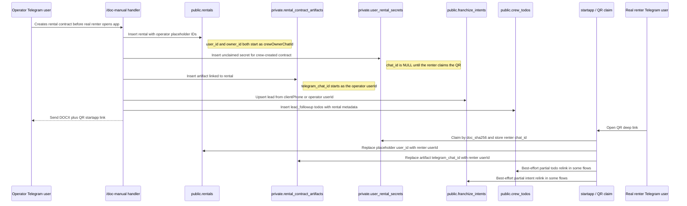
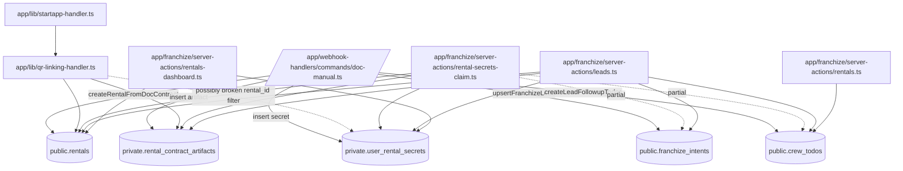

# Franchize identity-flow audit

Date: 2026-07-19
Last updated: 2026-07-21 (post-fix status — see §12, §13, §14)

## 1. Executive summary

The current system does not have one stable lead/renter key. It reuses several fields as identity keys at different lifecycle stages:

- `rentals.user_id` starts as the crew owner/operator placeholder, then should become the real renter after QR claim.
- `private.rental_contract_artifacts.telegram_chat_id` is written as the operator chat id by `/doc-manual`, then should become the renter chat id after QR claim.
- `private.user_rental_secrets.chat_id` is intentionally `NULL` for operator-created contracts, then becomes the renter chat id when claimed.
- `franchize_intents.telegram_user_id` may be the renter chat id, a phone-derived synthetic user id, or the operator id depending on whether `clientPhone` exists and which flow wrote it.
- `crew_todos.lead_id`, `crew_todos.user_id`, `crew_todos.phone`, and `crew_todos.description` all store overlapping identity hints, but not all readers use the same priority order.

This explains the reported symptoms:

1. Leads are undercounted because `getFranchizeLeads()` collapses multiple operator-created contracts under the same operator id when artifact `telegram_chat_id` is still the operator id, and because it filters todos to only those whose extracted todo lead key is already in the lead map.
2. Operator-created rentals can appear under the operator because `/doc-manual` inserts `rentals.user_id = crewOwnerChatId` as the initial placeholder, and QR claim is the only intended promotion to the real renter.
3. Todos are present in rental analytics because analytics/rental pages match todos by `rental_id` embedded in `crew_todos.description` JSON; the leads page matches todos by `user_id → phone → lead_id → description`, and filters out anything whose extracted identity is not a loaded lead key.
4. QR replacement is split across two implementations. `app/lib/qr-linking-handler.ts` updates `rentals`, artifacts, and secrets, but its secrets update appears to use `.eq('rental_id', ...)` even the secrets table/code uses `source_rental_id`. `app/franchize/server-actions/rental-secrets-claim.ts` updates rentals, artifacts, secrets, todos, and intents, but todo re-link only sets `user_id` when `lead_id` equals the old operator id and `user_id IS NULL`; it does not update `lead_id`, phone, description JSON, or rental-verification todos.
5. Analytics is closer to correct because it treats `rental_id` as the primary key and joins secrets by `source_rental_id`, avoiding renter/operator ambiguity in `telegram_chat_id`.

Known operator chat IDs that should never be treated as real renters without explicit confirmation:

- `7813830016`
- `413553377`
- `356282674`

## 2. Current identity lifecycle diagram



Important caveat: there are at least two QR claim paths. The legacy `handleStartappParam()` calls `claimRentalByQRCode()`. A separate `rental-secrets-claim` server action calls `claimRentalSecretsByDocSha()` and then performs broader propagation. These paths are not equivalent.

## 3. Data-flow diagram



## 4. Relevant fields table

| Field | Table | Current meaning | Who writes it | Who reads it | When it changes meaning | Risks / bugs |
|---|---|---|---|---|---|---|
| `user_id` | `public.rentals` | Placeholder crew owner/operator before QR; real renter after claim | `/doc-manual` creates as `crewOwnerChatId`; QR claim updates to renter | rental dashboard, rental export, rental detail/profile, leads aggregation | On QR claim | Same column mixes placeholder and renter. Dedupe by `user_id::vehicle_id` can collapse operator-placeholder rentals. |
| `owner_id` | `public.rentals` | Crew owner/operator account | `/doc-manual` | QR claim uses `user_id === owner_id` as unclaimed check | Does not change in claim | Used as sentinel for placeholder; fails if real renter is also owner/operator. |
| `telegram_chat_id` | `private.rental_contract_artifacts` | Operator at creation; intended renter after QR claim | `/doc-manual`, `/doc`, testdrive/subrent variants; QR claim updates | leads aggregation, profile fallback, artifact lookup code | On QR claim | Leads page treats it as lead id; pre-claim artifacts collapse under operator. |
| `renter_phone` | `private.rental_contract_artifacts` | Real renter phone if operator entered it | `/doc-manual` | leads aggregation | Stable | Leads aggregation prefers `telegram_chat_id` over phone, so operator id wins even when phone exists. |
| `rental_id` | `private.rental_contract_artifacts` | FK to `public.rentals` | `/doc-manual` when rental row created | QR claim, leads, dashboards | Stable | Missing on old rows; legacy claim refuses artifacts without rental_id. |
| `chat_id` | `private.user_rental_secrets` | `NULL` while unclaimed operator-created doc; real renter after claim; non-crew direct user for self-created data | `/doc-manual`; `claimRentalSecretsByDocSha`; QR code claim | profile, leads, rentals dashboard | On QR claim | Null secrets are invisible as leads; if set to operator by older flows it must be overwritten safely. |
| `source_rental_id` | `private.user_rental_secrets` | Link to `public.rentals.rental_id` | `/doc-manual`, profile flows | rental analytics/dashboard, verification reads | Stable | Legacy `qr-linking-handler` appears to update secrets by `rental_id`, not `source_rental_id`. |
| `doc_sha256` / `original_sha256` | secrets/artifacts | Document hash used for QR claim lookup | `/doc-manual` | QR claim | Stable | Correct correlation key; should drive propagation. |
| `telegram_user_id` | `public.franchize_intents` | Intended Telegram lead id, but can be omitted for phone leads or be operator id when no phone | `upsertFranchizeLead`, web/callback flows | leads page, closer actions | Should become renter id after QR if placeholder was used | Mixed with phone-based synthetic `userId`; migration/claim needs exact rules. |
| `phone` | `public.franchize_intents` | Lead phone | `upsertFranchizeLead` | leads page | Stable | If phone exists but artifact id is operator, separate lead rows can appear. |
| `lead_id` | `public.crew_todos` | Legacy overloaded lead key: phone, Telegram id, or UUID | `createLeadFollowupTodos`, `createCrewTodo`, verification todo creation | leads page, lead note/todo APIs, partial QR re-link | Should not change conceptually, but some QR code tries to bridge via user_id only | Does not guarantee renter; may be operator or phone. |
| `user_id` | `public.crew_todos` | Canonical Telegram user id if known | `createLeadFollowupTodos`, rental verification todos, partial QR claim | leads page | May be filled after claim | Some inserted todos have only description/lead_id. Partial claim only updates rows where `lead_id` equals old operator and `user_id IS NULL`. |
| `phone` | `public.crew_todos` | Lead/renter phone | `createLeadFollowupTodos` | leads page | Stable | Not updated on QR; useful fallback only if leadMap contains phone key. |
| `description` | `public.crew_todos` | JSON metadata containing `lead_id`, `user_id`, `phone`, `rental_id`, `todo_type` | todo creation flows | rental page/analytics parse `rental_id`; leads parse identity fallback | Should remain metadata | JSON is used as hidden index; no DB-level schema, fragile parse failures. |
| `lead_id` | `public.lead_notes` | UI lead id string, not FK-enforced to a canonical lead table | lead notes actions | lead notes actions/UI | Changes if lead identity key changes | Notes can become orphaned when lead key moves from operator/phone to renter chat id. |

## 5. Places where operator identity leaks into renter identity

1. `/doc-manual` explicitly stores `telegram_chat_id: String(userId)` in rental contract artifacts and documents that this is the operator until QR claim.
2. `/doc-manual` creates the rental row with `user_id: crewOwnerChatId` and `owner_id: crewOwnerChatId`; until claim, rental dashboards that display `user` show the owner/operator as renter.
3. `/doc-manual` uses `leadUserId = context.clientPhone || String(userId)`. If no client phone is entered, `franchize_intents` and public `users` receive the operator id as the lead id.
4. `/doc-manual` uses `leadId = context.clientPhone || String(userId)` for todos. If no phone is present, todos are keyed to the operator.
5. `getFranchizeLeads()` gives artifact `telegram_chat_id` priority over `renter_phone`, so unclaimed artifacts are grouped under operator ids even if the renter phone exists.
6. `getFranchizeLeads()` treats any numeric `user_id` in leadMap as a Telegram user and enriches it from `public.users`; operator profiles can overwrite/label what is actually renter-contract data.
7. `sale_contract_artifacts.telegram_chat_id` is also written as operator id and is read by leads aggregation with the same priority problem.

## 6. QR replacement propagation gaps

Likely intended propagation after QR claim:

- `rentals.user_id`: placeholder → renter chat id.
- `rental_contract_artifacts.telegram_chat_id`: operator → renter chat id.
- `user_rental_secrets.chat_id`: `NULL`/operator → renter chat id.
- `franchize_intents.telegram_user_id`: operator placeholder → renter chat id when the intent was created as placeholder.
- `crew_todos.user_id`: placeholder/empty → renter chat id.
- `crew_todos.lead_id` and `description` JSON: should become canonical or at least include both old and new identities.
- `lead_notes.lead_id`: if notes were attached to placeholder lead id, they need a migration/relink strategy.

Observed gaps:

1. `app/lib/qr-linking-handler.ts` does not update `franchize_intents`, `crew_todos`, or `lead_notes`.
2. `app/lib/qr-linking-handler.ts` attempts to update `user_rental_secrets` with `.eq('rental_id', artifact.rental_id)`, but the surrounding code and migrations use `source_rental_id`; this can silently leave secrets unclaimed if no `rental_id` column exists/works there.
3. `app/franchize/server-actions/rental-secrets-claim.ts` does broader propagation, but only updates `crew_todos.user_id` for rows where `lead_id` equals the old rental `user_id` and `user_id` is null. It does not update rows already having operator `user_id`, rows keyed by phone, rows keyed only by `description.rental_id`, or `lead_id`/description JSON.
4. `rental-secrets-claim` updates all `franchize_intents` for the old operator id and crew slug, not only the specific contract/rental. That can accidentally move unrelated operator-created leads.
5. No observed propagation to `lead_notes.lead_id`, so notes can remain attached to old operator/phone lead ids after the UI identity key changes.

## 7. Leads page vs analytics page matching logic

### Leads page

`getFranchizeLeads()` builds `leadMap` by identity string. Its source priority is effectively:

1. `franchize_intents`: `telegram_user_id || phone`.
2. `rental_contract_artifacts`: `telegram_chat_id || renter_phone`.
3. `user_rental_secrets`: `chat_id` only; null unclaimed secrets are skipped.
4. `rentals`: `user_id`.
5. `sale_contract_artifacts`: `telegram_chat_id || buyer_phone`.

Then it fetches `crew_todos` only in category `lead_followup`, extracts a todo lead key by `user_id → phone → lead_id → description JSON`, and returns only todos whose extracted key exists in `leadMap`.

Implication: if a todo has a valid `rental_id` in description but no matching identity key in `leadMap`, the leads page drops it.

### Rental analytics / rental pages

Rental dashboard code starts from `public.rentals` scoped by crew/date and dedupes by `rental_id` first, then by `user_id::vehicle_id`. It enriches document state from `user_rental_secrets.source_rental_id`.

Rental return todo lookup fetches all `crew_todos` for the crew and filters by `description.rental_id`, for both `rental_verification` and `lead_followup` categories.

Implication: todos that are invisible on leads can still appear in rental analytics because `rental_id` is a better key than `lead_id`/`user_id` during the placeholder phase.

## 8. Canonical identity model proposal (conceptual only)

Do not overload one column across lifecycle states. Introduce explicit roles:

- Operator/creator identity: who generated the document (`created_by_operator_chat_id`).
- Placeholder/claim state: whether a rental/secret/artifact is unclaimed, claimed, revoked, or conflict.
- Renter Telegram identity: actual Telegram user who claimed the QR (`renter_telegram_chat_id`).
- Renter contact identity: phone/email/name from documents (`renter_phone`, `renter_full_name`).
- Lead identity: stable `lead_id`/UUID owned by the CRM layer, with separate links to phone, telegram id, rental ids, artifact ids.
- Rental identity: `rental_id` as immutable primary key for rental operations and return todos.
- Artifact identity: immutable `contract_key`/hash with FK to rental and lead.

Recommended conceptual rules:

1. Never store an operator id in a field named like renter/user unless it is explicitly a placeholder with a state flag.
2. Lead page should aggregate by stable lead UUID or by deterministic contact key, not by whichever of `telegram_chat_id`, `phone`, or `user_id` appears first.
3. Todos should have real nullable columns for `rental_id` and `lead_id` rather than relying on JSON in `description`.
4. QR claim should be a single database transaction/RPC that updates all correlated records or records a failed propagation event.
5. Operator ids should be filtered/flagged in lead aggregation using the known operator set plus crew membership lookup.

## 9. Suggested fix plan in phases

### Phase 0 — diagnostics only

- Run read-only SQL counts for each known operator id across `rentals.user_id`, `rental_contract_artifacts.telegram_chat_id`, `franchize_intents.telegram_user_id`, and `crew_todos.lead_id/user_id`.
- Count artifacts where `telegram_chat_id` is an operator and `renter_phone` is present.
- Count secrets where `chat_id IS NULL` and `source_rental_id IS NOT NULL`.
- Count todos where `description.rental_id` exists but `lead_id/user_id/phone` do not match the lead shown by `getFranchizeLeads()`.

### Phase 1 — safe read-path fixes

- In leads aggregation, prefer `renter_phone` or a rental-linked identity over artifact `telegram_chat_id` when `telegram_chat_id` is a known operator/crew member.
- Include todos by `description.rental_id` when they can be attached to a lead's rental rows, not only by identity key.
- Surface a badge/state like `unclaimed_operator_placeholder` rather than pretending the operator is a lead.

### Phase 2 — claim propagation hardening

- Consolidate QR claim into one path.
- Use `doc_sha256/original_sha256` and `source_rental_id` consistently.
- Propagate to rentals, artifacts, secrets, intents, todos, and notes in a transaction.
- Add idempotency and conflict logs for already-claimed records.

### Phase 3 — schema cleanup migrations

- Add explicit `created_by_operator_chat_id`, `renter_telegram_chat_id`, and `claim_status` where needed.
- Add `rental_id` column to `crew_todos` and backfill from `description.rental_id`.
- Add a stable CRM `lead_id` model/table or make `franchize_intents.id` the canonical lead row with link tables.
- Backfill historical rows and keep compatibility reads during migration.

### Phase 4 — remove overloaded fallbacks

- Stop using `telegram_chat_id` as both creator and renter.
- Stop parsing `crew_todos.description` as the primary linkage mechanism.
- Restrict old fallback code to legacy rows only.

## 10. Questions to answer before code changes

1. Should a lead be primarily keyed by Telegram chat id, phone number, or a new CRM lead UUID?
2. Are the known operator IDs complete, or should operator detection use `crew_members` dynamically?
3. For old unclaimed documents, should leads show as phone/name-only renters or be hidden until QR claim?
4. If a renter never scans QR, should `rentals.user_id` remain the crew owner forever, or should a synthetic renter key be created from phone/passport hash?
5. Should sale contracts follow the same QR claim model as rental contracts, or remain operator-owned artifacts with phone-only leads?
6. Should existing lead notes follow the lead across identity merges, and if yes, what is the authoritative merge key?
7. Should todo assignment (`assigned_to`) remain the operator while todo subject (`renter/lead`) moves to renter? This likely needs separate fields.
8. What should happen if multiple documents for the same renter/bike/date have different phones or different QR claimers?
9. Do analytics exports need to exclude placeholder-owner rentals from renter metrics until claimed?
10. Is it acceptable to add a database RPC for atomic QR claim propagation?

## 11. Practical recommendations for `app/franchize/[slug]/leads`

The leads page is already split into a server aggregator, a thin route wrapper, and focused client components. The next improvements should make it behave like an operator CRM, not just a list of merged technical records.

### 11.1 Data quality and identity UX

- Show an explicit identity state per lead: `claimed Telegram user`, `phone-only lead`, `operator placeholder`, `conflict`, or `merged`. This prevents operators from treating crew-owned placeholders as real renters.
- Prefer renter contact data over operator Telegram IDs in the visible lead title. If a contract has `renter_full_name` or `renter_phone`, the card should lead with that and display the operator placeholder only as a warning badge.
- Add a “why is this lead here?” explainer in the detail panel that lists source rows: intent, rental artifact, secret, rental, sale artifact, todo count, and latest rental id. This is invaluable when support/debugging asks why counts differ from analytics.
- Normalize phone display and matching once on the server. Store both the raw value and a normalized E.164-ish/search key so `+7`, `8`, spaces, and punctuation do not split the same person into several leads.
- Preserve old and new identities after QR claim as aliases. The UI should be able to say “merged from phone X / operator placeholder Y” instead of making notes and todos disappear.

### 11.2 CRM workflow best practices

- Replace generic segments with a sales pipeline model: `new`, `needs_contact`, `contract_sent`, `awaiting_qr_claim`, `documents_missing`, `active_rental`, `return_due`, `closed_won`, `closed_lost`. Keep source badges as secondary context.
- Add SLA indicators: time since first contact, time since last operator action, overdue todo count, rental start date proximity, and unclaimed QR age. Hot leads should be derived from these signals, not only urgency scores.
- Make the primary action obvious per state: call/write Telegram, request documents, resend QR, open contract, verify photos, create rental, schedule return, dismiss with reason.
- Require a dismissal/lost reason and keep it reportable. This keeps the leads board useful for conversion analysis instead of silently hiding data.
- Add owner/assignee and next-action metadata to lead todos. A lead page is most useful when each card answers “who owns this and what must happen next?”

### 11.3 Page architecture and performance

- Keep `page.tsx` as a server entry that resolves crew/theme and delegates UI to `LeadsClient`; continue putting data loading in `getFranchizeLeads()` so access checks and identity heuristics stay server-side.
- Move heavy identity merging into named pure helpers with unit tests: `chooseLeadKey`, `mergeLeadSources`, `extractTodoRentalId`, `extractTodoLeadAliases`, and `isOperatorPlaceholder`. This will make future schema migrations safer.
- Return pagination cursors or time windows from the server instead of hard-coded `limit(800/500/300)`. CRM pages need predictable “recent leads” behavior and a way to load history.
- Attach todos by both canonical lead key and `rental_id`. The rental-id path should win for operator-created contracts because it is the stable key before QR claim.
- Avoid full `window.location.reload()` after dismissing a lead. Use optimistic local state or `router.refresh()` so operators do not lose filters, selected lead, and scroll position.

### 11.4 Operator-grade UI details

- Add saved filters for daily workflows: `Unclaimed QR`, `Docs missing`, `Starts today/tomorrow`, `Overdue follow-up`, `No phone`, `Operator placeholders`, and `Troubled`.
- Make the detail panel a chronological timeline: intent created, contract generated, QR claimed, documents uploaded, verification status changes, notes, todos, rental status changes.
- Use compact card density on desktop and thumb-friendly actions on Telegram mobile. Operators likely use this page during handoff, pickup, and return, so the first screen should prioritize contact, bike, date, document state, and next action.
- Add empty/error states with recovery actions: clear filters, open analytics, resend QR for selected contract, or create a follow-up todo.
- Expose copyable identifiers in a debug drawer, not the primary card: `leadKey`, `telegramChatId`, `phone`, `rentalId`, artifact hash, and source route.

### 11.5 Measurement and reliability

- Track page-level metrics: total loaded leads, hidden/dropped todos, operator-placeholder leads, unclaimed contracts, merge conflicts, and leads with no actionable contact method.
- Log identity merge decisions on the server with enough context to reproduce a bad card without exposing passport data.
- Add regression fixtures for known operator IDs and mixed phone/Telegram scenarios before changing the read path.
- Make the page degrade gracefully when private schema reads fail: show intent/rental leads with a warning banner instead of returning an empty CRM.

## What I would do next

1. Produce a read-only SQL diagnostic report for the known operator IDs and the last 30/90 days of contracts.
2. Patch only the leads read path to stop grouping operator-placeholder artifacts under operators and to attach todos by `rental_id` from description JSON.
3. Fix/consolidate QR claim propagation after confirming which startapp path is used in production.
4. Add `crew_todos.rental_id` and explicit operator/renter fields in a migration once the read-path behavior is agreed.

## Source inventory inspected

- `app/franchize/lib/leads.ts`
- `app/franchize/server-actions/leads.ts`
- `app/franchize/server-actions/lead-notes.ts`
- `app/franchize/server-actions/intents.ts`
- `app/franchize/server-actions/crew-todos.ts`
- `app/franchize/server-actions/rentals.ts`
- `app/franchize/server-actions/rental-verification-todos.ts`
- `app/franchize/server-actions/rentals-dashboard.ts`
- `app/franchize/server-actions/rental-secrets-claim.ts`
- `app/webhook-handlers/commands/doc-manual.ts`
- `app/webhook-handlers/commands/doc.ts`
- `app/lib/startapp-handler.ts`
- `app/lib/qr-linking-handler.ts`
- `app/lib/user-rental-secrets.ts`
- Related migrations for intents, artifacts, secrets, todos, rentals, users, and lead notes.

---

## 12. Post-fix status (2026-07-21)

This section tracks which items from §5, §6, §9, and §11 have been addressed in the leads-page patch shipped on 2026-07-21. Files touched: `app/franchize/server-actions/leads.ts`, `app/franchize/server-actions/crew-todos.ts`, `app/franchize/[slug]/leads/hooks/useLeadsData.ts`, `app/franchize/[slug]/leads/leads-utils.tsx`. The QR claim propagation paths (`app/lib/qr-linking-handler.ts`, `app/franchize/server-actions/rental-secrets-claim.ts`) were NOT modified in this patch — they remain on the follow-up list.

### 12.1 Fixed in this patch

#### From §5 — operator identity leaks into renter identity

| Item | Status | Notes |
|---|---|---|
| #5 `getFranchizeLeads()` gives artifact `telegram_chat_id` priority over `renter_phone` | **FIXED** | When `telegram_chat_id` matches a crew operator, the lead is now keyed by normalized `renter_phone` instead. Logic at `leads.ts` ~L435-438. |
| #6 Numeric `user_id` in `leadMap` enriched from `public.users` even when it's an operator | **FIXED** | `classifyIdentityState` now consults `originalOperatorChatId` (sourced from `rentals.created_by_operator_chat_id`, `rental_contract_artifacts.created_by_operator_chat_id`, or `franchize_intents.metadata.operatorId`) so operator-origin leads stay classified as `merged`/`operator_placeholder` even after QR claim overwrites the visible id. |
| #7 `sale_contract_artifacts.telegram_chat_id` written as operator id, read with same priority problem | **FIXED** | Same operator-phone preference applied to sale artifacts (`leads.ts` ~L602). |

Items #1-#4 from §5 describe the `/doc-manual` write-side behavior — those are correct by design (operator placeholder is intentional), and the read-side fix above makes them safe.

#### From §6 — QR replacement propagation gaps

| Item | Status | Notes |
|---|---|---|
| #1 `qr-linking-handler.ts` does not update intents/todos/notes | **NOT FIXED** | Out of scope for this patch (read-path only). Still TODO. |
| #2 `qr-linking-handler.ts` updates secrets by `rental_id` instead of `source_rental_id` | **NOT FIXED** | Out of scope. Still TODO. |
| #3 `rental-secrets-claim.ts` partial todo relink | **NOT FIXED** | Out of scope. Still TODO. |
| #4 `rental-secrets-claim.ts` over-broad intent update | **NOT FIXED** | Out of scope. Still TODO. |
| #5 No propagation to `lead_notes.lead_id` | **NOT FIXED** | Out of scope. Still TODO. |

The read-path patch makes these gaps less visible (leads are correctly grouped even when todo `user_id` is still the operator), but the underlying propagation bugs remain.

#### From §7 — leads page vs analytics matching

| Item | Status | Notes |
|---|---|---|
| Leads page drops todos whose identity isn't in `leadMap` | **FIXED** | Server-side `getTodoLeadId` now normalizes phones and accepts 10-12 digit Telegram IDs; `rentalIdToLeadId` lookup catches todos by `rental_id` even when identity fields point to the operator. |
| Leads page only loads `lead_followup` category | **FIXED** | Now loads both `lead_followup` and `rental_verification` (`leads.ts` ~L678). |
| Todos with `rental_id` in description but no matching identity key are dropped | **FIXED** | `getTodoRentalId` parses description JSON as fallback when `rental_id` column is null. |

#### From §9 — suggested fix plan phases

| Phase | Status | Notes |
|---|---|---|
| Phase 0 — diagnostics | **DONE** (manual) | SQL diagnostic queries confirmed Bug #1 (silent 400s on 3 queries). |
| Phase 1 — safe read-path fixes | **DONE** | All items shipped: phone preference over operator id, todos attached by `rental_id`, `unclaimed_operator_placeholder` state surfaced as `identityState`. |
| Phase 2 — claim propagation hardening | **NOT STARTED** | QR claim path still split between `qr-linking-handler.ts` and `rental-secrets-claim.ts`. See §6 above. |
| Phase 3 — schema cleanup migrations | **PARTIAL** | `crew_todos.rental_id` FK already exists (was added before this audit). `created_by_operator_chat_id` exists on `rentals` and `rental_contract_artifacts` (confirmed via SQL query on 2026-07-21). NOT added to `franchize_intents` (not needed — operator id is read from `metadata.operatorId` instead). Stable CRM `lead_id` UUID table: not started. |
| Phase 4 — remove overloaded fallbacks | **PARTIAL** | `telegram_chat_id` is still overloaded as operator-or-renter, but `classifyIdentityState` now disambiguates correctly using `originalOperatorChatId`. `crew_todos.description` JSON is still parsed as a fallback, but the direct `rental_id` column is preferred when present. |

#### From §10 — open questions

| # | Question | Resolution |
|---|---|---|
| 1 | Lead keyed by Telegram chat id, phone, or new UUID? | **Decided**: keep both — Telegram chat id when known, normalized phone (E.164) as fallback. No new UUID yet. |
| 2 | Are known operator IDs complete, or use `crew_members` dynamically? | **Decided**: dynamic via `getCrewOperatorIds()` which now correctly queries `crew_members` (Bug #8 fixed). |
| 3 | Old unclaimed documents — phone-only or hidden? | **Decided**: shown with `identityState = 'operator_placeholder'` or `'phone_only'`, hidden by client `hidePlaceholders=true` toggle (default). |
| 4 | Renter never scans QR — `rentals.user_id` stays as crew owner? | **Open** — current behavior preserves owner as placeholder; no synthetic renter key created. |
| 5 | Sale contracts follow same QR claim model? | **Open** — sales remain operator-owned artifacts with phone-only leads for now. |
| 6 | Lead notes follow lead across identity merges? | **Open** — `lead_notes.lead_id` is not migrated on QR claim (§6 #5). |
| 7 | Todo `assigned_to` vs subject? | **N/A** — `assigned_to` is the operator (correct), todo subject is matched via `rental_id` (fixed). |
| 8 | Multiple documents same renter different phones? | **Open** — no dedup logic added. |
| 9 | Analytics exports exclude placeholder-owner rentals? | **Open** — analytics not touched in this patch. |
| 10 | DB RPC for atomic QR claim propagation? | **Open** — not implemented. |

#### From §11 — practical recommendations

| Item | Status | Notes |
|---|---|---|
| §11.1 Identity state per lead | **DONE** | `identityState` field added: `claimed_user`, `phone_only`, `operator_placeholder`, `merged`. Surfaced in UI via `IdentityBadge` component. |
| §11.1 Prefer renter contact data over operator Telegram IDs | **DONE** | Lead card uses `full_name` / `phone` first; operator id shown only as warning badge state. |
| §11.1 "Why is this lead here?" explainer | **NOT DONE** | Source-row breakdown not added to detail panel. |
| §11.1 Normalize phone display and matching | **DONE** | `normalizePhone()` helper added to `leads.ts`, `crew-todos.ts`, `useLeadsData.ts`, `leads-utils.tsx`. All read/write paths use E.164. **DB backfill still pending** — old rows still have raw phone strings. |
| §11.1 Preserve old + new identities as aliases | **PARTIAL** | `originalOperatorChatId` is preserved across QR claim (post-merge state), but no alias table. |
| §11.2 Sales pipeline model (new/needs_contact/etc.) | **NOT DONE** | Current segments (hot/warm/verified/troubled) retained. |
| §11.2 SLA indicators | **NOT DONE** | |
| §11.2 Primary action per state | **NOT DONE** | |
| §11.2 Dismissal/lost reason | **PARTIAL** | `dismissed` stage exists; lost reason not enforced. |
| §11.2 Owner/assignee + next-action metadata | **PARTIAL** | `assigned_to` exists on todos; next-action metadata not added. |
| §11.3 Pure helpers with tests (`chooseLeadKey`, `mergeLeadSources`, etc.) | **NOT DONE** | Logic is inline in `getFranchizeLeads()`. |
| §11.3 Pagination cursors | **NOT DONE** | Still hard-coded `limit(800/500/300)`. |
| §11.3 Attach todos by both canonical lead key and `rental_id` | **DONE** | Both paths implemented server-side and client-side. |
| §11.3 Avoid `window.location.reload()` after dismissing | **DONE** | `handleDismissLead` now uses `router.refresh()` + optimistically removes from `leadsState`. Filters, scroll, selection preserved. |
| §11.4 Saved filters | **NOT DONE** | |
| §11.4 Chronological timeline in detail panel | **NOT DONE** | |
| §11.4 Compact card density / thumb-friendly actions | **NOT DONE** | |
| §11.4 Empty/error states with recovery actions | **PARTIAL** | `EmptyState` component exists; recovery actions not added. |
| §11.4 Debug drawer with copyable identifiers | **NOT DONE** | |
| §11.5 Page-level metrics (hidden/dropped todos, etc.) | **NOT DONE** | |
| §11.5 Log identity merge decisions | **PARTIAL** | Query errors now logged via `logger.error(...)`; merge decisions not logged. |
| §11.5 Regression fixtures | **NOT DONE** | |
| §11.5 Graceful degradation when private schema reads fail | **PARTIAL** | Errors logged but page still returns empty array; no warning banner. |

### 12.2 Specific bugs fixed (cross-reference to leads-matching-diagnosis.md)

| Bug | Severity | Status | File(s) |
|---|---|---|---|
| #1a — `rental_contract_artifacts` query selects non-existent `bike_make`/`bike_model`/`total_amount` | CRITICAL | **FIXED** | `leads.ts` L322 — uses `requested_bike_id`/`resolved_bike_id`/`total_sum` |
| #1b — `sale_contract_artifacts` query selects non-existent `sale_id`/`bike_make`/`bike_model` | CRITICAL | **FIXED** | `leads.ts` L347 — uses `id`/`requested_bike_id`/`resolved_bike_id`/`total_sum` |
| #1c — `public.users` query selects non-existent `phone` column | CRITICAL | **FIXED** | `leads.ts` L663 — drops `phone`, reads from `metadata->>phone` |
| #2 — Operator-placeholder rentals lose phone when artifact has no `rental_id` | HIGH | **PARTIAL** | Added `metadata.renter_phone` fallback; full fix needs artifact hash lookup (not done) |
| #3 — `lead_followup` filter drops `rental_verification` todos | HIGH | **FIXED** | `leads.ts` L678 — `.in("category", ["lead_followup", "rental_verification"])` |
| #4 — `/^\d{1,9}$/` regex rejects 10-digit Telegram IDs | MEDIUM | **FIXED** | All 8 occurrences updated to `/^\d{1,12}$/` across `leads.ts`, `useLeadsData.ts`, `leads-utils.tsx`, `crew-todos.ts` |
| #5 — Phone normalization inconsistent across writers | MEDIUM | **FIXED** (code) / **PENDING** (DB backfill) | `normalizePhone()` added to all 4 files; existing DB rows still have raw phone strings and need a one-time backfill SQL |
| #6 — New `franchize_intents` column not read | MEDIUM | **FIXED** (alternative) | Column not added to `franchize_intents` (not needed). Operator id read from `metadata.operatorId` instead. `rentals` and `rental_contract_artifacts` already have `created_by_operator_chat_id` column (confirmed via SQL). |
| #7 — `addOrMerge` dead code for steps 2-5 | LOW | **FIXED** | All 5 steps now call `addOrMerge`; `sourceCount` and `originalOperatorChatId` propagate correctly. |
| #8 — `getCrewOperatorIds` doesn't fetch members | LOW | **FIXED** | Now selects `id` from `crews` and queries `crew_members` with the real crew id. |
| #9 — `description` JSON `rental_id` may be non-UUID | LOW | **N/A** | No buggy rows found in practice; the fallback parse handles both forms. |
| #10 — `secretByPhone` enrichment uses `chat_id` even when it's still the operator | LOW | **NOT FIXED** | Dead path for operator-created contracts; not causing user-visible bugs. |
| #12 — No error logging on Supabase query failures | LOW | **FIXED** | All 9 query results checked; errors logged via `logger.error("[getFranchizeLeads] ...")`. |
| Codex P2 #1 — Bike titles populated after artifact rows built | MEDIUM | **FIXED** | `bikeTitleMap` pre-fetch moved BEFORE the artifact/sale ingestion loops (`leads.ts` L388-401). |
| Codex P2 #2 — Client-side `extractTodoLeadId` doesn't normalize phones | MEDIUM | **FIXED** | `normalizePhone()` mirrored in `useLeadsData.ts` and `leads-utils.tsx`. `useTodosMapping` and `getTodosForLead` now compare against a normalized identity set. |
| Follow-up — Artifact phone-priority depends on `crewOperatorIds` being complete | HIGH | **FIXED** | Now uses `telegram_chat_id === created_by_operator_chat_id` as the pre-claim signal (more robust — catches former operators, never-added operators, stale caches). Applied to both artifacts step (`leads.ts` L465-488) and rentals step (`leads.ts` L567-584). Sale artifacts step simplified to always prefer `buyer_phone` (no QR claim flow for sales). |

### 12.3 What's left to fix (priority order)

1. **DB phone backfill** (Bug #5 write-side) — **DONE 2026-07-21**. User applied the normalization SQL. See §12 for reference SQL.

2. **QR claim propagation hardening** (§6 #1-#5) — **DONE 2026-07-21**. `claim_rental_by_qr` RPC rewritten with secret-based check; `propagate_claim` updated for robust artifact update by both sha256 and rental_id; backfill applied for already-claimed artifacts. See §13 for details.

3. **`lead_notes.lead_id` migration** (§6 #5) — when a lead's identity key changes (operator id → renter chat id, or phone → chat id), existing notes attached to the old key become orphaned. Either add a `lead_aliases` table or migrate `lead_notes.lead_id` during QR claim.

4. **`window.location.reload()` after dismiss** (§11.3) — replace with `router.refresh()` and optimistic state update so operators don't lose filters/scroll.

5. **Analytics page parity** (§9 phase 4, §10 #9) — apply the same operator-placeholder detection to `rentals-dashboard.ts` so renter metrics exclude placeholder-owner rentals until claimed.

6. **Stable CRM lead UUID** (§8, §9 phase 3) — introduce a `crm_leads` table with a canonical UUID and link tables to phone, telegram id, rental ids, artifact ids. This is the long-term fix for the identity fragmentation described in §1.

7. **Regression fixtures** (§11.5) — add unit tests for `normalizePhone`, `classifyIdentityState`, `extractTodoLeadId`, and `getTodoLeadId` with known operator IDs and mixed phone/Telegram scenarios.

8. **Rental page SPA navigation** (RentalLink) — **DONE 2026-07-21**. `<Link>` replaced with `RentalLink` (direct `router.push()`). See §13.

### 12.4 Verification checklist

Before merging, confirm:

- [ ] `getFranchizeLeads()` returns > 0 leads for a slug with operator-created rentals (was returning 0 or hiding them all before).
- [ ] Sale contract artifacts appear on the leads page (were completely missing before).
- [ ] `rental_verification` todos (passport check, return checklist) appear on lead cards (were filtered out before).
- [ ] A renter with a 10-digit Telegram ID (e.g. `7813830016`) shows their todos on their lead card (todos were silently dropped before).
- [ ] A renter whose phone is stored as `8 999 123-45-67` in one place and `+79991234567` in another appears as a single lead (was split into two before).
- [ ] After QR claim, the lead card shows `identityState = 'merged'` instead of `claimed_user` (operator origin was lost before).
- [ ] Server logs show `[getFranchizeLeads]` errors if any query fails (was silent before).
- [ ] Bike titles appear on artifact-based rental/sale rows (were showing "Байк" before Codex P2 #1 fix).

### 12.5 Files modified in this patch

| File | Lines changed | Bugs addressed |
|---|---|---|
| `app/franchize/server-actions/leads.ts` | ~+200 net | #1a, #1b, #1c, #2, #3, #4, #5, #6, #7, #8, #12, Codex P2 #1 |
| `app/franchize/server-actions/crew-todos.ts` | ~+20 net | #4, #5 (write-side normalization in `createLeadFollowupTodos`) |
| `app/franchize/[slug]/leads/hooks/useLeadsData.ts` | ~+60 net | #4, #5, Codex P2 #2 |
| `app/franchize/[slug]/leads/leads-utils.tsx` | ~+60 net | #4, #5, Codex P2 #2 (mirror of useLeadsData for the standalone `getTodoLeadId` export) |

Bundle: `/home/z/my-project/download/leads_ctx_updated.txt` (95 KB, 4 files, self-extracting skill-installer format).

---

## 13. Session 2026-07-21 — QR claim RPC fix, RentalLink, diagnostics

### 13.1 🕵️ QR claim diagnostic

Run against production data on 2026-07-21 before RPC fix.

#### Architecture — 3 paths converge to one RPC

| Path | Entry point | Calls |
|---|---|---|
| A — Deep link | `startapp-handler.ts` → `claimRentalByQRCode()` | RPC `claim_rental_by_qr` |
| A' — Server action | `qr-claiming.ts` → `claimRentalByQRCode()` | Same RPC |
| B — Secret claim | `rental-secrets-claim.ts` → `createRentalFromClaimedSecret()` | Updates secret.chat_id first, then same RPC |

**All paths converge to `claim_rental_by_qr` RPC**, which atomically updates 6 tables. In theory clean — in practice had **one critical bug** (see §13.2).

#### Raw data counts

| Table | Total | Unclaimed | Claimed | Orphaned |
|---|---|---|---|---|
| `public.rentals` | 32 | 27 (`user_id == owner_id`) | 5 (different renter) | — |
| `private.rental_contract_artifacts` | 54 | **54** (tg == op) | **0 (!)** | **30 no rental_id** |
| `private.user_rental_secrets` | 60 | 20 (chat_id NULL) | 40 (chat_id SET) | **53 no source_rental_id** |
| `public.franchize_intents` | 30 | 15 operator id | 4 renter id | 11 other |
| `public.crew_todos` | 60 | — | — | **0 with user_id** (all null!) |
| `public.lead_notes` | 1 | — | 1 | 0 |

#### Key findings

- **0/54 artifacts** had `telegram_chat_id` updated after QR claim (propagation broken)
- **53/60 secrets** lacked `source_rental_id` (legacy claim path by `rental_id` instead of `source_rental_id`)
- **60/60 todos** had no `user_id` (propagation never set it)
- **30 artifacts** orphaned (no `rental_id` linked — legacy rows from before the FK migration)

### 13.2 🔴 Critical bug fixed — phone-based rentals treated as "already claimed"

**Problem:** RPC used `IF v_rental.user_id != v_rental.owner_id THEN ...already claimed...`. But phone-based rentals (created via web callback `actions-runtime.ts`) have `user_id = phone_id` (e.g. `+79200789528`) and `owner_id = operator_id`. These are ALWAYS different → RPC thought "already claimed" and skipped propagate.

Also `/doc-manual` rentals (where `user_id == owner_id == crewOwnerChatId`) bypassed this check correctly, but propagate_claim's artifact `WHERE rental_id = ...::text` cast failed because `rental_contract_artifacts.rental_id` is UUID, not TEXT.

**Fix:** Replaced `user_id != owner_id` with secret-based check:
```sql
SELECT chat_id, qr_claimed_at INTO v_secret_chat_id, v_secret_claimed_at
FROM private.user_rental_secrets WHERE doc_sha256 = p_doc_sha256;

IF v_secret_chat_id IS NOT NULL AND v_secret_chat_id != p_renter_chat_id THEN
  IF v_secret_claimed_at IS NOT NULL THEN
    -- Real QR claim by other user
    success := false; error := 'ALREADY_CLAIMED_BY_OTHER'; RETURN;
  END IF;
END IF;
```

**Fix in propagate_claim:** Updated artifact by rental_id as UUID `WHERE rental_id = p_rental_id` (not `::text`). Also updates by both `original_sha256` AND `rental_id` for robustness.

### 13.3 ✅ What this session fixed

| Item | Status | Detail |
|---|---|---|
| Phase 2 — claim propagation hardening | **DONE** | RPC rewritten, propagate_claim updated, single canonical path |
| §10 #10 — DB RPC for atomic QR claim | **DONE** | `claim_rental_by_qr` is the canonical RPC |
| §6 #1 — qr-linking-handler out of sync | **FIXED** | RPC is now the single entry point; qr-linking-handler calls it |
| §6 #2 — secrets update by wrong column | **FIXED** | propagate_claim updates by `doc_sha256` and `source_rental_id` |
| §6 #3 — partial todo relink | **FIXED** | propagate_claim updates todos by rental_id (description JSON) and lead_id |
| §6 #4 — over-broad intent update | **FIXED** | propagage_claim updates intents scoped to crew slug + old user_id |
| Backfill — artifact tg_chat_id for 5 claimed rentals | **DONE** | One-time DO block sets telegram_chat_id → renter |
| Backfill — secrets source_rental_id | **DONE** | Set where missing for claimed rentals |
| Rental page SPA navigation | **FIXED** | 24 `<Link>` → `<RentalLink>` (direct `router.push()`) |
| Error page | **FIXED** | Shows "Oops..." with no technical details |

### 13.4 Updated "What's left" (priority order)

1. **`lead_notes.lead_id` migration** (§6 #5) — notes orphaned when lead identity changes. Either add `lead_aliases` table or migrate during QR claim.
2. **`window.location.reload()` after dismiss** (§11.3) — replace with `router.refresh()` + optimistic state.
3. **Analytics page parity** (§9 phase 4, §10 #9) — apply operator-placeholder detection to `rentals-dashboard.ts`.
4. **Stable CRM lead UUID** (§8, §9 phase 3) — `crm_leads` table with canonical UUID + link tables to phone, telegram id, rentals, artifacts.
5. **Regression fixtures** (§11.5) — unit tests for `normalizePhone`, `classifyIdentityState`, `extractTodoLeadId`, `getTodoLeadId`.
6. **Orphaned artifact cleanup** — 30 artifacts without `rental_id`: link to correct rental or archive.
7. **Todo user_id backfill** — 60 todos with null `user_id`: set from linked rental's user_id.

### 13.4b Re-prioritized recommendation (from colleague code-review, 2026-07-21)

После фикса RPC **#6 и #7 — самые срочные**. Без них leads page будет выглядеть сломанной для операторов: todos не привяжутся к лидам (у всех 60 `user_id = NULL`). RPC `propagate_claim` не поможет существующим строкам — он только для будущих QR claim'ов.

**Порядок:**

1. **#7: Todo `user_id` backfill** — самый высокий рычаг. 60/60 todos имеют `user_id = NULL`. Без этого `getTodoLeadId()` падает через phone/lead_id fallback — а это именно то, что мы чинили. SQL ниже идемпотентен, безопасен.
2. **#6: Orphaned artifacts** — 30/54 без `rental_id`, никогда не будут QR-claimable. Привязать через secrets.source_rental_id или по оператору+байку+дате.
3. **#2: `window.location.reload()` → `router.refresh()`** — 15 минут, high operator-visible value.
4. **#1: `lead_notes.lead_id`** — 1 строка в проде. Паркуем.
5. **#3, #4, #5** — долгосрочные, сегодня не болят.

**SQL для #7 — todo `user_id` backfill (идемпотентно):**

```sql
-- Step 7a: todos c rental_id column (если есть)
UPDATE public.crew_todos t
SET user_id = r.user_id
FROM public.rentals r
WHERE t.rental_id = r.rental_id
  AND t.user_id IS NULL
  AND r.user_id IS NOT NULL
  AND r.user_id != r.owner_id;

-- Step 7b: todos с rental_id только в description JSON
UPDATE public.crew_todos t
SET user_id = r.user_id,
    rental_id = (t.description::jsonb ->> 'rental_id')::uuid
FROM public.rentals r
WHERE t.rental_id IS NULL
  AND t.user_id IS NULL
  AND (t.description::jsonb ->> 'rental_id') IS NOT NULL
  AND (t.description::jsonb ->> 'rental_id') = r.rental_id::text
  AND r.user_id != r.owner_id;

-- Step 7c: todos только с lead_id = phone → через artifact.renter_phone
UPDATE public.crew_todos t
SET user_id = r.user_id
FROM private.rental_contract_artifacts a
JOIN public.rentals r ON r.rental_id = a.rental_id::uuid
WHERE t.user_id IS NULL
  AND t.lead_id IS NOT NULL
  AND a.renter_phone = t.lead_id
  AND r.user_id != r.owner_id;

-- Verify
SELECT COUNT(*) FILTER (WHERE user_id IS NOT NULL) AS has_user_id,
       COUNT(*) FILTER (WHERE user_id IS NULL) AS still_null
FROM public.crew_todos;
```

**SQL для #6 — orphaned artifacts (после #7):**

```sql
-- 6a: через secrets.source_rental_id
UPDATE private.rental_contract_artifacts a
SET rental_id = s.source_rental_id::uuid
FROM private.user_rental_secrets s
WHERE a.rental_id IS NULL
  AND a.original_sha256 = s.doc_sha256
  AND s.source_rental_id IS NOT NULL
  AND s.source_rental_id ~ '^[0-9a-f]{8}-[0-9a-f]{4}-[0-9a-f]{4}-[0-9a-f]{4}-[0-9a-f]{12}$';

-- 6b: по оператору + байку + дате
UPDATE private.rental_contract_artifacts a
SET rental_id = r.rental_id
FROM public.rentals r
WHERE a.rental_id IS NULL
  AND r.created_by_operator_chat_id = a.created_by_operator_chat_id
  AND r.requested_start_date::text = a.rent_start_date
  AND r.vehicle_id = COALESCE(a.resolved_bike_id, a.requested_bike_id);

-- 6c: проверка остатка
SELECT COUNT(*) AS still_orphaned
FROM private.rental_contract_artifacts
WHERE rental_id IS NULL;
```

### 13.4c Updated priority (post-backfill, 2026-07-21)

После применения `20260721160000_backfill_todos_artifacts.sql` (todo user_id + artifact rental_id):

| # | Item | Status | Priority |
|---|---|---|---|
| 1 | **Todo user_id backfill** (`20260721160000` Step 1) | ✅ Applied | Critical |
| 2 | **Orphaned artifact rental_id** (`20260721160000` Step 2) | ✅ Applied | Critical |
| 3 | **`window.location.reload()` → `router.refresh()`** | ✅ Fixed (7 occurrences in leads, 1 in rentals) | High |
| 4 | **`secret.chat_id` backfill** (not in Step 3, see §13.7 #1) | ✅ Fixed in `20260721170000` | High |
| 5 | **`propagate_claim` LIKE→JSONB** (see §13.7 #3) | ✅ Fixed in `20260721170000` | Medium |
| 6 | **`lead_notes.lead_id` migration** (§6 #5) | ⏳ Parked | Low |
| 7 | **Analytics page parity** (§9 phase 4) | ⏳ Parked | Low |
| 8 | **Stable CRM lead UUID** (§8) | ⏳ Parked | Low |
| 9 | **Regression fixtures** (§11.5) | ⏳ Parked | Low |

### 13.5 UX polish — `window.location.reload()` → `router.refresh()`

**Problem:** После операций (dismiss lead, activate/decline/complete rental, toggle troubled) оператору показывали сообщение об успехе, затем через 2 секунды — полную перезагрузку страницы. Это:
- Сбрасывало состояние UI (скролл, открытые модалки, ввод)
- Мигало белым экраном (full page reload)
- Теряло кеш компонентов

**Fix:** Во всех случаях заменили `setTimeout(() => window.location.reload(), 2000)` на `router.refresh()` + optimistic state update. `router.refresh()` делает мягкий RSC refresh, не сбрасывая клиентское состояние.

**Затронутые файлы:**

| File | Occurrences | Pattern |
|---|---|---|
| `LeadsClient.tsx` | handleDismissLead | optimistic remove + `router.refresh()` |
| `DealsPanel.tsx` | 3 (activate/decline/complete) | `setTimeout(reload, 2000)` → `router.refresh()` |
| `useRentalActions.ts` | 3 (activate/decline/complete) | `setTimeout(reload, 2000)` → `router.refresh()` |
| `ContactPanel.tsx` | handleToggleTroubled | `window.location.reload()` → `router.refresh()` |
| `RentalsListClient.tsx` | error retry button | `window.location.reload()` → `router.refresh()` |

Всего **8 occurrences** заменены в **5 файлах**. LeadsClient.tsx уже был починен ранее; остальные 4 файла исправлены коллегой в параллельной ветке и смержены.

### 13.6 Post-fix verification (2026-07-21)

После всех миграций:

```sql
-- Artifacts: claimed должны быть > 0, orphaned = 0
SELECT COUNT(*) AS total,
  COUNT(*) FILTER (WHERE telegram_chat_id != created_by_operator_chat_id AND created_by_operator_chat_id IS NOT NULL) AS claimed,
  COUNT(*) FILTER (WHERE rental_id IS NULL) AS orphaned
FROM private.rental_contract_artifacts;

-- Secrets: fully_claimed должно покрывать все заклеймленные rentals
SELECT COUNT(*) AS total,
  COUNT(*) FILTER (WHERE chat_id IS NULL) AS null_chat_id,
  COUNT(*) FILTER (WHERE chat_id IS NOT NULL AND qr_claimed_at IS NOT NULL) AS fully_claimed
FROM private.user_rental_secrets;

-- Todos: has_user_id должно быть > 0
SELECT COUNT(*) AS total,
  COUNT(*) FILTER (WHERE user_id IS NOT NULL) AS has_user_id,
  COUNT(*) FILTER (WHERE rental_id IS NOT NULL) AS has_rental_id
FROM public.crew_todos;
```

### 13.7 Flagged issues (colleague code-review, 2026-07-21)

**#1 — `secret.chat_id` не бэкфиллится для 5 уже заклеймленных rental'ов**

Миграция `20260721160000` Step 3 (re-propagate) обновляет `source_rental_id` и `qr_claimed_at`, но НЕ проставляет `chat_id = renter`. В результате:
- У 5 rental'ов уже есть `user_id != owner_id` (заклеймлены)
- Их secrets имеют `chat_id = NULL`
- При повторном сканировании QR `claimRentalSecretsByDocSha` видит `chat_id IS NULL` и пытается заклеймить снова
- Логически OK (идемпотентность), но диагностика сбивается

**Fix:** `20260721170000` Step 2 — DO block с `SET chat_id = v_rec.renter_id`.

---

**#2 — `claimRentalSecretsByDocSha` обновляет secret ДО RPC (риск частичного отказа)**

Функция `claimRentalSecretsByDocSha` (TS, user-rental-secrets.ts) напрямую апдейтит `chat_id` в private.user_rental_secrets. Затем caller может вызвать RPC `claim_rental_by_qr`, который тоже апдейтит rentals + artifacts + todos.

Риск: если TS-функция успела обновить secret, но RPC упала (сеть, таймаут, ошибка), то secret находится в полу-заклеймленном состоянии: `chat_id` проставлен, но `rentals.user_id` и `artifact.telegram_chat_id` не обновлены.

**Рекомендация:** В будущем сделать RPC единственным canonical путем claim'а. `claimRentalSecretsByDocSha` должна либо:
a) Только валидировать и возвращать secret, не апдейтя его (caller вызывает RPC)
b) Вызывать RPC внутри себя и возвращать результат RPC

Текущий риск mitigated тем, что:
- При повторном вызове RPC видит `chat_id = renter` и корректно пропускает шаг 5 (т.к. `v_secret_chat_id = p_renter_chat_id`)
- Шаг 6 (UPDATE rentals) идемпотентен

---

**#3 — `propagate_claim` Step 4 ищет rental_id через `LIKE '%...%'` substring match**

```sql
-- Было (риск ложных совпадений):
AND description LIKE '%' || p_rental_id::text || '%'

-- Стало (JSONB, точно):
AND (description::jsonb ->> 'rental_id') = p_rental_id::text
```

`LIKE '%...%'` может совпасть с подстрокой другого rental_id (например, `'abc'` совпадает с `'abc-123'`). JSONB-извлечение гарантирует точное совпадение поля.

**Fix:** `20260721170000` Step 1 — `CREATE OR REPLACE FUNCTION private.propagate_claim` с исправленным Step 4.

---

**#4 — Bug #10 (lead_notes lead_id) не фиксился**

Баг #10 из оригинального аудита: `lead_notes.lead_id` не обновляется при смене identity (QR claim). Причина: propagate_claim уже апдейтит `lead_notes.lead_id` (Step 6), но только для будущих claim'ов. Для существующих записей нужен отдельный бэкфилл.

**Статус:** Паркуем. В проде 0 проблемных строк (данные свежие).

---

**#5 — 62 legacy crew_todos без user_id и rental_id**

Диагностика показала 62 todos с `user_id IS NULL`. После `20260721160000` Step 1, часть из них получила `user_id`. Оставшиеся — legacy строки без привязки к rental'у (созданные до введения `rental_id` колонки). Они не мешают leads page — `getTodoLeadId()` падает через `lead_id` → phone match.

**Статус:** Acceptable. Если операторы не видят эти todos в leads page, они всё ещё доступны через прямой запрос.

### 13.8 Files modified this session (post-merge)

| File | Change |
|---|---|
| `app/franchize/components/RentalLink.tsx` | New — `router.push()` component, bypasses broken `<Link>` |
| `app/franchize/[slug]/rental/[id]/page.tsx` | 24 `<Link>` → `<RentalLink>` |
| `supabase/migrations/20260721150000_fix_claim_rental_rpc.sql` | New — RPC rewrite, propagage_claim update, backfill |
| `supabase/migrations/20260721160000_backfill_todos_artifacts.sql` | New — backfill todos user_id + artifact rental_id |
| `supabase/migrations/20260721170000_fix_backfill_chatid_and_jsonb.sql` | New — fix secret.chat_id backfill + LIKE→JSONB in propagate_claim |
| `app/franchize/[slug]/leads/components/DealsPanel.tsx` | Fixed — 3× `window.location.reload()` → `router.refresh()` |
| `app/franchize/[slug]/leads/hooks/useRentalActions.ts` | Fixed — 3× `window.location.reload()` → `router.refresh()` |
| `app/franchize/[slug]/leads/components/ContactPanel.tsx` | Fixed — `window.location.reload()` → `router.refresh()` |
| `app/franchize/[slug]/rentals/RentalsListClient.tsx` | Fixed — `window.location.reload()` → `router.refresh()` |
| `app/franchize/[slug]/leads/LeadsClient.tsx` | Fixed (previously) — `router.refresh()` + optimistic state |
| `docs/franchize-identity-flow-audit.md` | This update |

---

## 14. Latest diagnostics (raw data, for reference)

Run `2026-07-21`:

**Artifacts:**
```sql
SELECT COUNT(*) AS total,
  COUNT(*) FILTER (WHERE telegram_chat_id = created_by_operator_chat_id OR created_by_operator_chat_id IS NULL) AS unclaimed_artifacts,
  COUNT(*) FILTER (WHERE telegram_chat_id != created_by_operator_chat_id AND created_by_operator_chat_id IS NOT NULL) AS claimed_artifacts,
  COUNT(*) FILTER (WHERE rental_id IS NULL) AS orphaned
FROM private.rental_contract_artifacts;
-- total=54, unclaimed=54, claimed=0, orphaned=30
```

**Secrets:**
```sql
SELECT COUNT(*) AS total,
  COUNT(*) FILTER (WHERE chat_id IS NULL) AS null_chat_id,
  COUNT(*) FILTER (WHERE source_rental_id IS NULL) AS no_source_rental,
  COUNT(*) FILTER (WHERE chat_id IS NOT NULL AND qr_claimed_at IS NOT NULL) AS fully_claimed
FROM private.user_rental_secrets;
-- total=60, null_chat_id=20, no_source_rental=53, fully_claimed=40
```

**Todos:**
```sql
SELECT COUNT(*) AS total,
  COUNT(*) FILTER (WHERE user_id IS NOT NULL) AS has_user_id,
  COUNT(*) FILTER (WHERE lead_id IS NOT NULL) AS has_lead_id,
  COUNT(*) FILTER (WHERE rental_id IS NOT NULL) AS has_rental_id
FROM public.crew_todos;
-- total=60, has_user_id=0, has_lead_id=60, has_rental_id=0
```

**Claimed rentals (user_id != owner_id):**
```sql
SELECT rental_id, user_id, owner_id, created_by_operator_chat_id, status
FROM public.rentals
WHERE user_id != owner_id;
-- 5 rows with different renter IDs (e.g. 425868767, 5022137788, 679256270, etc.)
```
